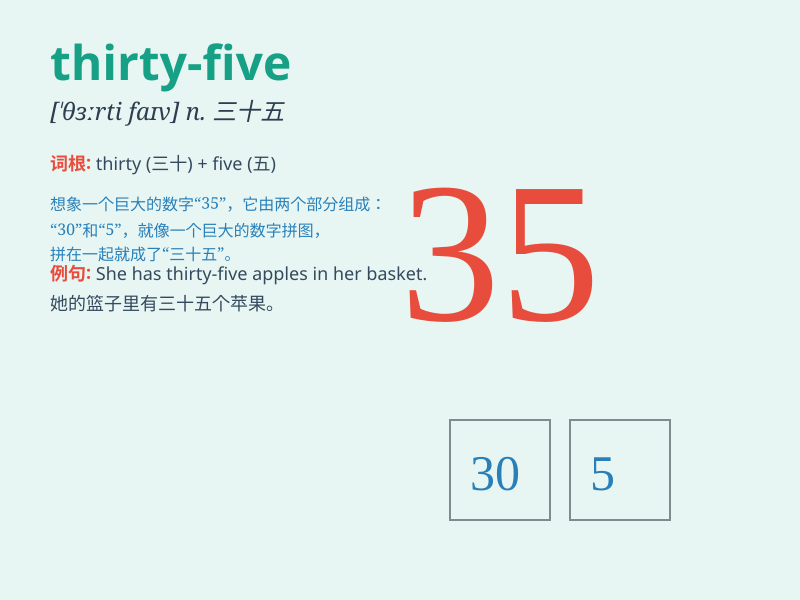

## thirty-five

**英音:** _[ˈθɜːti ˌfaɪv]_ **美音:** _[ˈθɜr ti ˌfaɪv]_

**译义:** *num.三十五，三十加五，位于三十四与三十六之间的自然数*

### 短语

+ **thirty-five years old:** _三十五岁_

+ **thirty-five dollars:** _三十五美元_

+ **thirty-five minutes:** _三十五分钟_

+ **thirty-five people:** _三十五个人_

+ **thirty-five kilometers:** _三十五公里_

### 例句

#### 例句1

> **I am thirty-five years old.**

**中文翻译:** 我三十五岁了。

**单词释义:** 三十五

#### 例句2

> **The price of this book is thirty-five yuan.**

**中文翻译:** 这本书的价格是三十五元。

**单词释义:** 三十五

#### 例句3

> **There are thirty-five students in our class.**

**中文翻译:** 我们班有三十五个学生。

**单词释义:** 三十五

### 背诵小故事

> One day, I was at the store and saw a price tag of thirty-five
dollars on a beautiful dress. I thought it was a bit expensive but still
considered buying it. It was a memorable number that day.

**有一天，我在商店里看到一件漂亮的裙子标价三十五美元。我觉得有点贵，但还是考虑买它。那一天，这个数字让人难忘。**

### 图义

