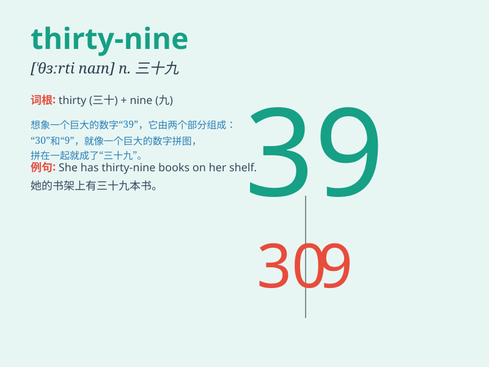

## thirty-nine

**英音:** _[ˈθɜːti naɪn]_ **美音:** _[ˈθɜːrti naɪn]_

**译义:** *三十九*

### 短语

+ **thirty-nine people:** _三十九个人_

+ **thirty-nine years old:** _三十九岁_

+ **thirty-nine dollars:** _三十九美元_

+ **thirty-nine minutes:** _三十九分钟_

+ **thirty-nine kilometers:** _三十九公里_

### 例句

#### 例句1

> **There are thirty-nine students in our class.**

**中文翻译:** 我们班有三十九名学生。

**单词释义:** 三十九（表示数量）

#### 例句2

> **The price of this dress is thirty-nine dollars.**

**中文翻译:** 这条裙子的价格是三十九美元。

**单词释义:** 三十九（表示价格）

#### 例句3

> **He has been working here for thirty-nine months.**

**中文翻译:** 他已经在这里工作了三十九个月。

**单词释义:** 三十九（表示时间长度）

### 背诵小故事

> One day, a little monkey was very happy because it found thirty-nine
bananas. But it had a hard time carrying them all. Finally, with the
help of its friends, it took the bananas home safely.

**一天，一只小猴子非常高兴，因为它找到了三十九根香蕉。但它很难把它们都搬走。最后，在朋友们的帮助下，它把香蕉安全地带回了家。**

### 图义

