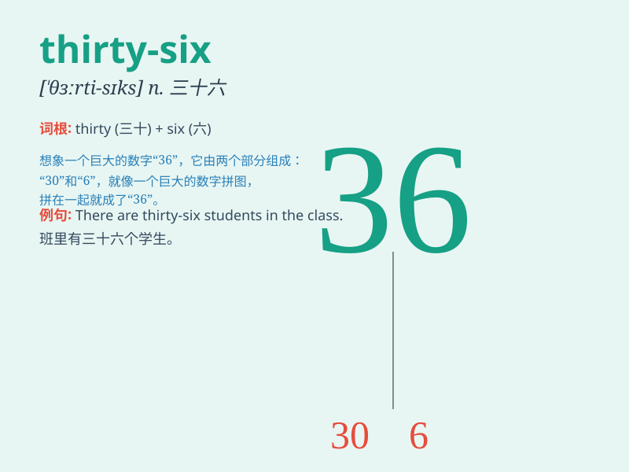

## thirty-six

**英音:** _[ˈθɜːti ˈsɪks]_ **美音:** _[ˈθɜrti ˈsɪks]_

**译义:** *num.三十六*

### 短语

+ **thirty-six hours:** _三十六小时_

+ **thirty-six people:** _三十六个人_

+ **thirty-six books:** _三十六本书_

+ **thirty-six cars:** _三十六辆车_

+ **thirty-six apples:** _三十六个苹果_

### 例句

#### 例句1

> **There are thirty-six students in our class.**

**中文翻译:** 我们班有三十六名学生。

**单词释义:** 三十六

#### 例句2

> **The book has thirty-six chapters.**

**中文翻译:** 这本书有三十六章。

**单词释义:** 三十六

#### 例句3

> **She is thirty-six years old.**

**中文翻译:** 她三十六岁了。

**单词释义:** 三十六

### 背诵小故事

> One day, a little monkey wanted to collect thirty-six bananas. It
climbed trees and searched everywhere. Finally, it got exactly
thirty-six bananas and was very happy.

**有一天，一只小猴子想要收集三十六根香蕉。它爬树到处寻找。最后，它正好得到了三十六根香蕉，非常开心。**

### 图义

