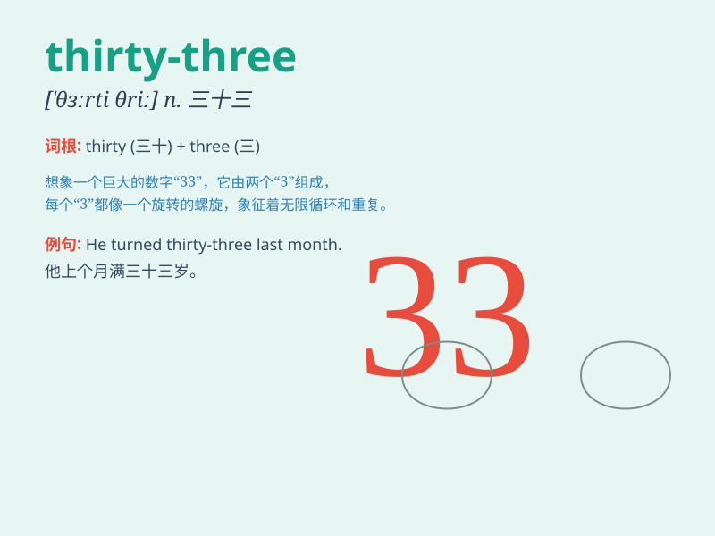

## thirty-three

**英音:** _[ˈθɜːti θriː]_ **美音:** _[ˈθɜːrti θriː]_

**译义:** *num.三十三*

### 短语

+ **thirty-three years old:** _三十三岁_

+ **thirty-three people:** _三十三人_

+ **thirty-three dollars:** _三十三美元_

+ **thirty-three books:** _三十三本书_

+ **thirty-three cats:** _三十三只猫_

### 例句

#### 例句1

> **I am thirty-three years old.**

**中文翻译:** 我三十三岁了。

**单词释义:** 三十三

#### 例句2

> **There are thirty-three students in our class.**

**中文翻译:** 我们班有三十三名学生。

**单词释义:** 三十三

#### 例句3

> **The price of this book is thirty-three yuan.**

**中文翻译:** 这本书的价格是三十三元。

**单词释义:** 三十三

### 背诵小故事

> One day, I was counting my money and found exactly thirty-three
dollars. I was so happy because I could buy the toy I wanted.
Thirty-three became a lucky number for me that day.

**有一天，我在数我的钱，发现正好有三十三美元。我非常高兴，因为我可以买我想要的玩具了。那天，三十三成了我的幸运数字。**

### 图义

