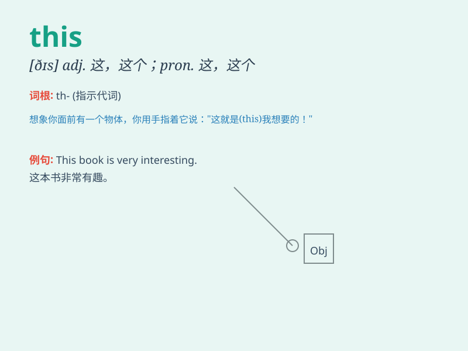

## this

**英音:** _[ðɪs]_ **美音:** _[ðɪs]_

**译义:** *adj.这,这个,今,本 pron.这,这个*

### 短语

+ **this morning:** _今天早上_

+ **this afternoon:** _今天下午_

+ **this evening:** _今天晚上_

+ **this week:** _本周_

+ **this year:** _今年_

### 例句

#### 例句1

> **This is my book.**

**中文翻译:** 这是我的书。

**单词释义:** 这；这个

#### 例句2

> **This pen is blue.**

**中文翻译:** 这支钢笔是蓝色的。

**单词释义:** 这；这个

#### 例句3

> **This way, please.**

**中文翻译:** 请这边走。

**单词释义:** 这；这个

### 背诵小故事

>
想象一下，你在一个神秘的房间里，突然看到一个发光的盒子。你指着它说\'this\'，意思就是'这个'发光的盒子很特别。你记住\'this\'就是用来特指眼前的这个东西。

**想象一下，你在一个神秘的房间里，突然看到一个发光的盒子。你指着它说'这个'，意思就是'这个'发光的盒子很特别。你记住'this'就是用来特指眼前的这个东西。**

### 图义

