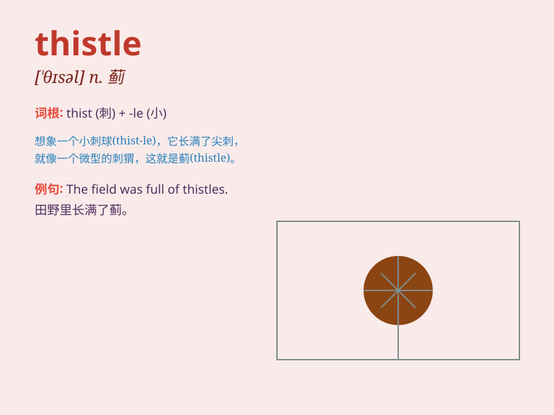

## thistle

**英音:** _[\'θɪs(ə)l]_ **美音:** _[\'θɪsl]_

**译义:** *n.[植]蓟*

### 短语

+ **Milk Thistle:** _水飞蓟_

+ **Scotch Thistle:** _苏格兰蓟_

+ **Canada Thistle:** _田蓟_

+ **Blessed Thistle:** _圣蓟_

+ **Spear Thistle:** _矛叶蓟_

### 例句

#### 例句1

> **The field was full of thistles.**

**中文翻译:** 这片田野长满了蓟。

**单词释义:** 蓟（一种植物）

#### 例句2

> **She carefully plucked the thistle from the garden.**

**中文翻译:** 她小心翼翼地从花园里拔掉了蓟。

**单词释义:** 蓟（一种植物）

#### 例句3

> **The thistle grew among the wildflowers.**

**中文翻译:** 蓟长在野花中间。

**单词释义:** 蓟（一种植物）

### 背诵小故事

> A brave knight was on a quest. He got lost in a field full of
thistles. The sharp thorns pricked him, but he didn\'t give up. He
remembered the thistle as a symbol of toughness.

**一位勇敢的骑士正在探险。他在一片满是蓟的田野里迷路了。尖锐的蓟刺扎到了他，但他没有放弃。他把蓟当作坚韧的象征记住了它。**

### 图义

