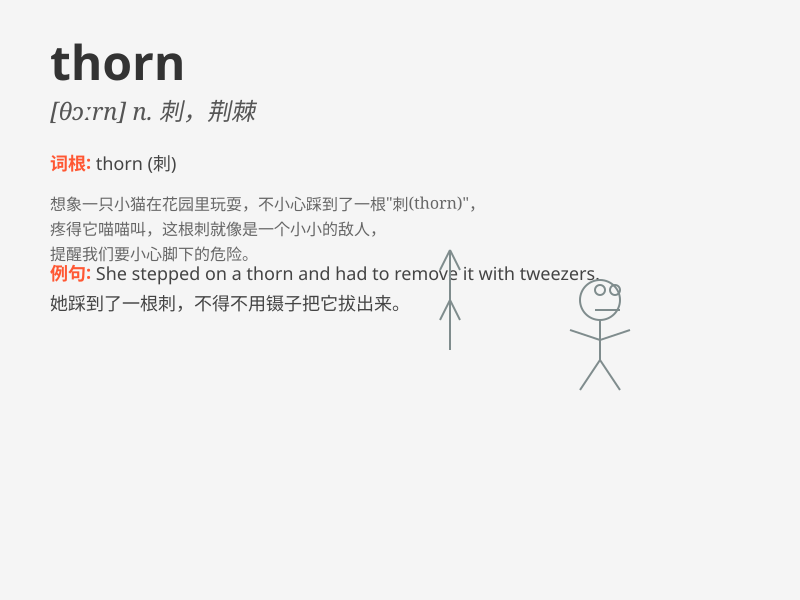

## thorn

**英音:** _[θɔːn]_ **美音:** _[θɔrn]_

**译义:** *n.[植]刺,棘,荆棘*

### 短语

+ **thorn in the flesh:** _比喻令人烦恼或痛苦的事物或人_

+ **thorn in the side:** _比喻持续困扰或烦扰的人或事物_

+ **rose without a thorn:** _比喻完美无缺的事物或人_

+ **be (as) thick as thieves with (someone):**
_与某人关系非常密切或亲密_

+ **throw thorns in someone\'s way:** _设置障碍或制造困难给某人_

### 例句

#### 例句1

> **The rose has sharp thorns.**

**中文翻译:** 这朵玫瑰有尖锐的刺。

**单词释义:** 刺；荆棘

#### 例句2

> **He got a thorn in his finger while picking strawberries.**

**中文翻译:** 他在摘草莓时手指扎了一根刺。

**单词释义:** 刺

#### 例句3

> **The path was full of thorns, making it difficult to walk.**

**中文翻译:** 这条小路布满了荆棘，行走艰难。

**单词释义:** 荆棘

### 背诵小故事

> Once upon a time, a brave adventurer was exploring a forest.
Suddenly, he felt a sharp pain in his foot. Looking down, he saw a THORN
sticking out of his shoe. It was a tiny but painful reminder to be
careful in the wild.

**从前，一位勇敢的探险家正在探索森林。突然，他感到脚一阵剧痛。低头一看，他看到一根刺从他的鞋子里扎出来。这是一个微小但痛苦的提醒，在野外要小心。**

### 图义

