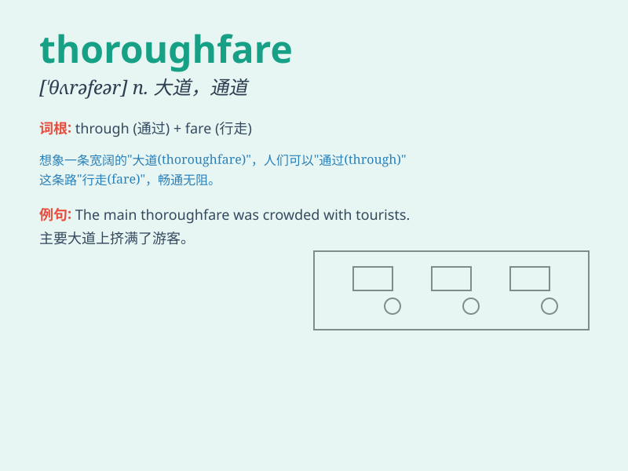

## thoroughfare

**英音:** _[\'θʌrəfeə]_ **美音:** _[\'θɝofɛr]_

**译义:** *n.通路,大道*

### 短语

+ **main thoroughfare:**
_主要街道，通常是城市中最繁忙和最重要的道路。_

+ **pedestrian thoroughfare:**
_人行通道，专门供行人使用的道路或通道。_

+ **thoroughfare closure:**
_道路封闭，指某条道路因施工、事故或其他原因而暂时关闭。_

+ **through thoroughfare:**
_直通道路，指可以直接通过而不需要转弯的道路。_

+ **public thoroughfare:**
_公共通道，指对公众开放的道路或通道，任何人都可以使用。_

### 例句

#### 例句1

> **The main thoroughfare was crowded with traffic.**

**中文翻译:** 这条主要的大道交通拥堵。

**单词释义:** 大道；干道

#### 例句2

> **This street is a busy thoroughfare.**

**中文翻译:** 这条街是一条繁忙的通道。

**单词释义:** 通道；通路

#### 例句3

> **They blocked off the thoroughfare for the parade.**

**中文翻译:** 他们为游行封锁了大道。

**单词释义:** 大道；大街

### 背诵小故事

> A little mouse was lost in a big city. It kept running and finally
found a thoroughfare that led it back home. The thoroughfare was wide
and busy, filled with people and cars.

**一只小老鼠在大城市里迷路了。它不停地跑，最后找到了一条大道，这条大道带它回了家。这条大道又宽又繁忙，满是人和车。**

### 图义

