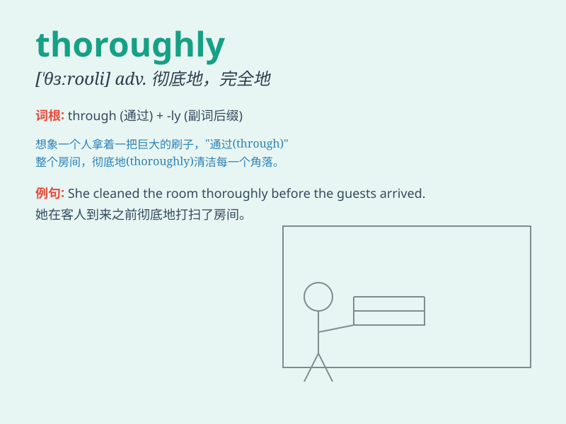

## thoroughly

**英音:** _[ˈθʌrəli]_ **美音:** _[ˈθʌrəʊli; θʌroli]_

**译义:** *adv.十分地,彻底地*

### 短语

+ **thoroughly enjoy:** _完全享受，充分享受某事物_

+ **thoroughly investigate:** _彻底调查，详细地研究或检查某事物_

+ **thoroughly understand:** _完全理解，对某事物有深刻的认识_

+ **thoroughly clean:** _彻底清洁，将某物清理得非常干净_

+ **thoroughly exhausted:** _筋疲力尽，完全耗尽了精力或体力_

### 例句

#### 例句1

> **The room was thoroughly cleaned.**

**中文翻译:** 这个房间被彻底打扫了。

**单词释义:** 彻底地；完全地

#### 例句2

> **She thoroughly enjoyed the concert.**

**中文翻译:** 她完全享受这场音乐会。

**单词释义:** 完全；十足地

#### 例句3

> **The report was thoroughly researched.**

**中文翻译:** 这份报告经过了彻底的研究。

**单词释义:** 彻底；全面地

### 背诵小故事

> A detective was investigating a case thoroughly. He checked every
clue, interviewed everyone, and left no stone unturned. Finally, he
solved the mystery thoroughly and caught the criminal.

**一位侦探在彻底地调查一个案件。他检查每一条线索，询问每一个人，彻彻底底，不放过任何蛛丝马迹。最终，他彻底地破了案并抓住了罪犯。**

### 图义

