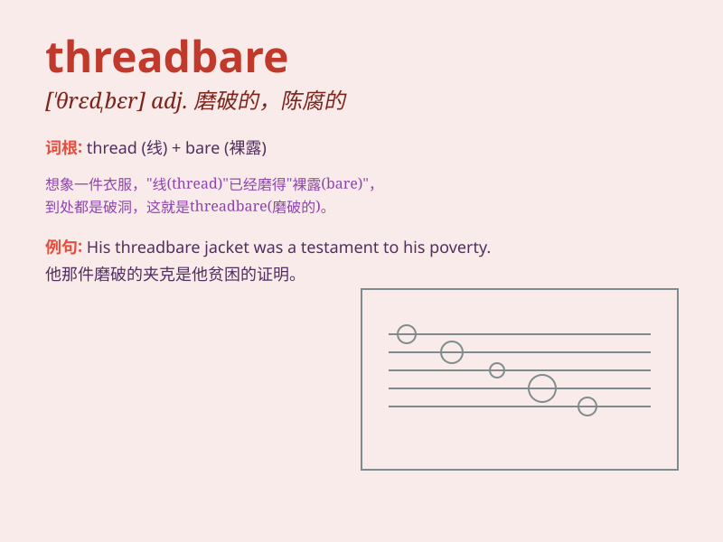

## threadbare

**英音:** _[\'θredbeə]_ **美音:** _[\'θrɛdbɛr]_

**译义:** *adj.穿破旧衣服的,俗套的*

### 短语

+ **threadbare coat:** _破旧的外套_

+ **threadbare carpet:** _磨损的地毯_

+ **threadbare excuse:** _站不住脚的借口_

+ **threadbare sofa:** _破旧的沙发_

+ **threadbare argument:** _陈腐的论点_

### 例句

#### 例句1

> **The sofa was covered with a threadbare blanket.**

**中文翻译:** 沙发上盖着一条破旧的毯子。

**单词释义:** 破旧的；磨薄的

#### 例句2

> **His excuses were becoming threadbare.**

**中文翻译:** 他的借口变得越来越站不住脚。

**单词释义:** 陈腐的；老一套的

#### 例句3

> **She wore a threadbare coat in the cold winter.**

**中文翻译:** 在寒冷的冬天，她穿着一件破旧的外套。

**单词释义:** 磨损的；破烂的

### 背诵小故事

> A poor man had only one threadbare coat. The fabric was so worn that
the threads were showing. It was clear the coat was old and in bad
condition. Poor man!

**一个穷人只有一件破旧的外套。这布料磨损得厉害，线都露出来了。很明显这件外套又旧又破。可怜的人！**

### 图义

