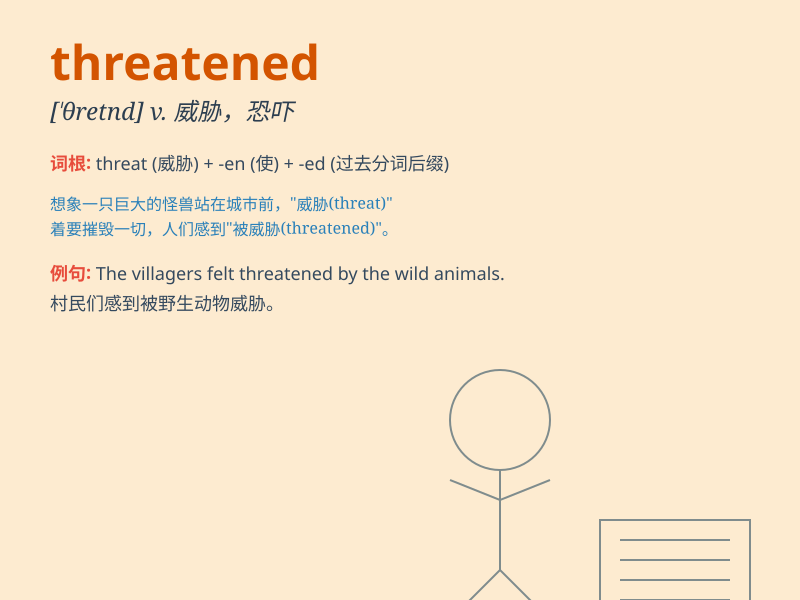

## threatened

**英音:** _[ˈθretnd]_ **美音:** _[ˈθrɛtnd]_

**译义:**
*v.威胁；恐吓（threaten的过去分词）adj.受到威胁的；可能发生的*

### 短语

+ **be threatened with:** _受到\...的威胁_

+ **threatened species:** _濒危物种_

+ **feel threatened:** _感到受到威胁_

+ **threatened environment:** _受威胁的环境_

+ **threatened action:** _威胁性的行动_

### 例句

#### 例句1

> **The company is threatened with bankruptcy.**

**中文翻译:** 这家公司面临破产的威胁。

**单词释义:** 受到威胁

#### 例句2

> **The species is threatened with extinction.**

**中文翻译:** 这个物种有灭绝的危险。

**单词释义:** 面临灭绝威胁

#### 例句3

> **She felt threatened by his presence.**

**中文翻译:** 他的出现让她感到受到威胁。

**单词释义:** 感到受威胁

### 背诵小故事

> A little rabbit was playing in the forest. Suddenly, a big wolf
appeared and threatened the rabbit, saying it would eat the rabbit. The
rabbit was so scared. But luckily, it found a hole and hid in time.

**一只小兔子正在森林里玩耍。突然，一只大狼出现并威胁小兔子，说要吃掉它。小兔子非常害怕。但幸运的是，它找到了一个洞并及时躲了进去。**

### 图义

