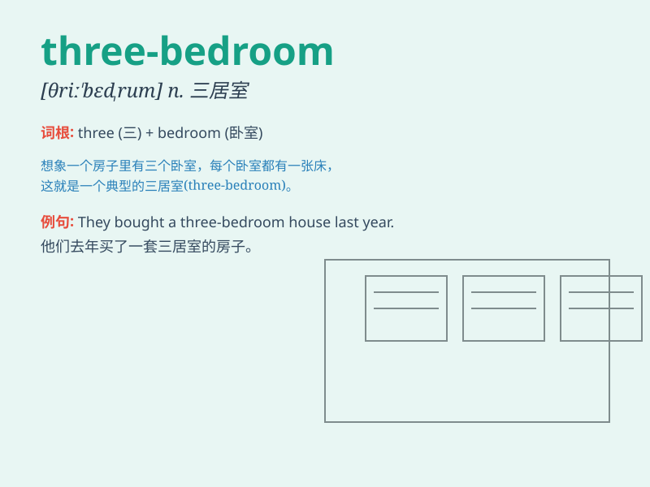

## three-bedroom

**英音:** _[θriː ˈbɛdˌrum]_ **美音:** _[θriː ˈbɛdˌrum]_

**译义:** *adj. 有三间卧室的；n. 三居室*

### 短语

+ **three-bedroom house:** _三居室的房子_

+ **three-bedroom apartment:** _三居室的公寓_

+ **three-bedroom flat:** _三居室的单元房_

+ **three-bedroom villa:** _三居室的别墅_

+ **three-bedroom cottage:** _三居室的村舍_

### 例句

#### 例句1

> **The three-bedroom house is very spacious and comfortable.**

**中文翻译:** 这套三居室的房子非常宽敞舒适。

**单词释义:** 三居室的

#### 例句2

> **They are looking for a three-bedroom apartment in the city
center.**

**中文翻译:** 他们正在市中心寻找一套三居室的公寓。

**单词释义:** 三居室的

#### 例句3

> **The three-bedroom villa has a beautiful garden.**

**中文翻译:** 这座三居室的别墅有一个美丽的花园。

**单词释义:** 三居室的

### 背诵小故事

> Once upon a time, a little girl dreamed of a house. She drew a
picture of a big house with THREE-BEDROOM. One for her parents, one for
herself, and one for guests. It was her perfect home.

**从前，有一个小女孩梦想有一座房子。她画了一幅有三个卧室的大房子的画。一间给她父母，一间给自己，一间给客人。这就是她理想中的家。**

### 图义

