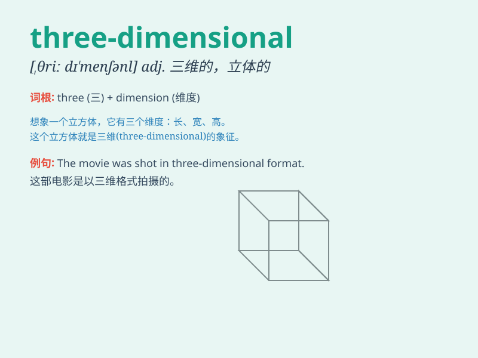

## three-dimensional

**英音:** _[ˌθriː.dɪ-menˈʃə.nəl]_ **美音:**
_[ˌθri.dɪˈmen.ʃə.nəl]_

**译义:** *形容词，三维的；立体的；具有三个维度的*

### 短语

+ **three-dimensional object:** _三维物体_

+ **three-dimensional space:** _三维空间_

+ **three-dimensional model:** _三维模型_

+ **three-dimensional image:** _三维图像_

+ **three-dimensional structure:** _三维结构_

### 例句

#### 例句1

> **The movie features stunning three-dimensional animations.**

**中文翻译:** 这部电影具有令人惊叹的三维动画。

**单词释义:** 三维的

#### 例句2

> **They are developing a three-dimensional model of the human
heart.**

**中文翻译:** 他们正在开发人类心脏的三维模型。

**单词释义:** 三维的

#### 例句3

> **The three-dimensional effect of this painting makes it look very
realistic.**

**中文翻译:** 这幅画的三维效果使其看起来非常逼真。

**单词释义:** 三维的

### 背诵小故事

> Imagine a magical cube. It\'s not just a flat shape. It has length,
width, and height. This cube is \'three-dimensional\'. It\'s real and
you can touch it from all sides. That\'s what \'three-dimensional\'
means!

**想象一个神奇的立方体。它不只是一个平面的形状。它有长、宽和高。这个立方体就是"三维的"。它是真实的，你可以从各个方面触摸到它。这就是"三维的"的意思！**

### 图义

