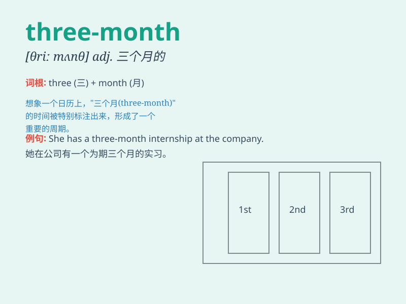

## three-month

**英音:** _[θriː mʌnθ]_ **美音:** _[θriː mʌnθ]_

**译义:** *adj. 三个月的；n. 三个月的时间*

### 短语

+ **three-month period:** _三个月的时期_

+ **three-month contract:** _三个月的合同_

+ **three-month internship:** _三个月的实习_

+ **three-month loan:** _三个月的贷款_

+ **three-month project:** _三个月的项目_

### 例句

#### 例句1

> **The three-month training program was very intense.**

**中文翻译:** 这个为期三个月的培训项目强度非常大。

**单词释义:** 为期三个月的

#### 例句2

> **She got a three-month internship at the company.**

**中文翻译:** 她在这家公司获得了一份三个月的实习机会。

**单词释义:** 三个月的

#### 例句3

> **The three-month project was finally completed on time.**

**中文翻译:** 这个为期三个月的项目终于按时完成了。

**单词释义:** 为期三个月的

### 背诵小故事

> Once upon a time, there was a little puppy. It needed three-month
training to become a smart and obedient dog. During those three months,
it learned many skills and finally grew up happily.

**从前，有一只小狗。它需要三个月的训练才能成为一只聪明听话的狗。在这三个月里，它学会了很多技能，最后快乐地长大了。**

### 图义

