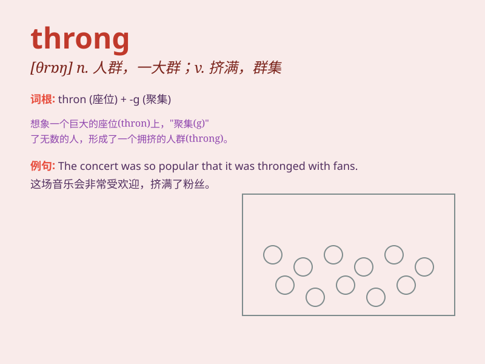

## throng

**英音:** _[θrɒŋ]_ **美音:** _[θrɔŋ]_

**译义:** *v.群集*

### 短语

+ **a throng of people:** _一群人_

+ **in the throng:** _在人群中_

+ **throng together:** _聚集在一起_

+ **throng into:** _涌入_

+ **a dense throng:** _密集的人群_

### 例句

#### 例句1

> **The street was thronged with people.**

**中文翻译:** 这条街挤满了人。

**单词释义:** 挤满

#### 例句2

> **Tourists thronged the ancient town during the holiday.**

**中文翻译:** 在假期期间，游客们挤满了这座古镇。

**单词释义:** 挤满

#### 例句3

> **Fans thronged outside the stadium to catch a glimpse of the
star.**

**中文翻译:** 粉丝们聚集在体育场外，只为看一眼这位明星。

**单词释义:** 聚集

### 背诵小故事

>
想象一下，在一个热闹的集市上，人们挤在一起，形成了一个密集的人群。这个人群就像一个\'throng\'。大家都在忙着购物、交流，人多得难以移动。

**想象在热闹集市上密集拥挤的人群来辅助记忆\'throng\'（人群；聚集的人群）这个单词**

### 图义

