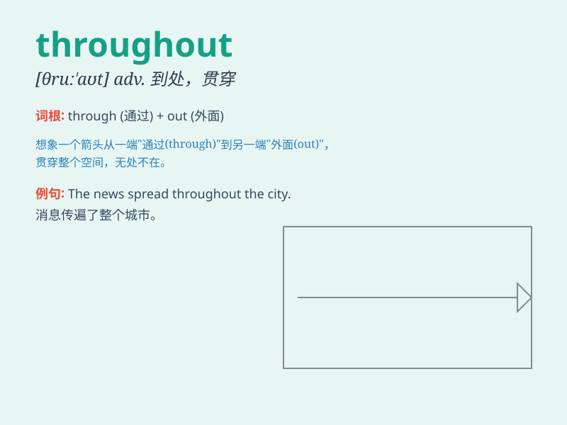

## throughout

**英音:** _[θruː\'aʊt]_ **美音:** _[θrʊ\'aʊt]_

**译义:** * prep.遍及,贯穿adv.到处,始终,全部*

### 短语

+ **throughout history:** _在整个历史上_

+ **throughout the day:** _一整天_

+ **throughout the year:** _全年；一整年_

+ **throughout the world:** _全世界；世界各地_

+ **throughout one\'s life:** _在某人的一生中_

### 例句

#### 例句1

> **The museum is open throughout the year.**

**中文翻译:** 这个博物馆全年开放。

**单词释义:** 自始至终；在整个期间

#### 例句2

> **She remained cheerful throughout the trip.**

**中文翻译:** 在整个旅行中她一直都很开心。

**单词释义:** 在整个\...期间

#### 例句3

> **The company\'s products are popular throughout the world.**

**中文翻译:** 这家公司的产品在全世界都很受欢迎。

**单词释义:** 遍及；到处

### 背诵小故事

> A brave explorer traveled throughout the mysterious forest. He
crossed rivers and climbed mountains, experiencing all kinds of
adventures. \'Throughout\' means from the beginning to the end,
everywhere within a particular area or period of time.

**一位勇敢的探险家在神秘的森林中到处旅行。他穿过河流，爬过高山，经历了各种各样的冒险。'throughout'意思是自始至终，在特定区域或时间段内的所有地方。**

### 图义

