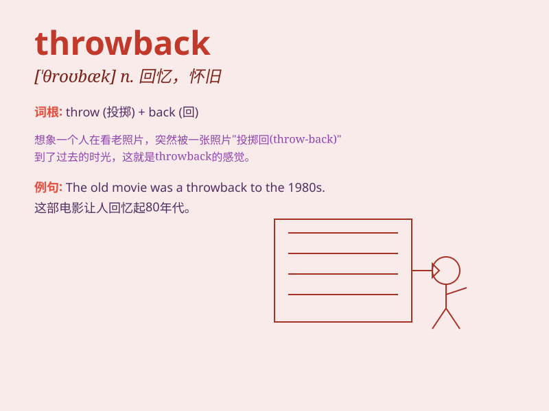

## throwback

**英音:** _[\'θrəʊbæk]_ **美音:** _[\'θrobæk]_

**译义:** *n.掷回,挫折,阻止,大倒退,[生]返祖*

### 短语

+ **throwback photo:** _怀旧照片_

+ **throwback Thursday:**
_怀旧星期四（在社交媒体上分享旧照片的日子）_

+ **throwback style:** _复古风格_

+ **throwback moment:** _怀旧时刻_

+ **throwback trend:** _复古潮流_

### 例句

#### 例句1

> **This dress is a throwback to the fashion of the 1950s.**

**中文翻译:** 这件连衣裙是对 20 世纪 50 年代时尚的一种复古。

**单词释义:** 复古；怀旧的事物

#### 例句2

> **The new album has a throwback sound that reminds people of the
80s music.**

**中文翻译:** 这张新专辑有一种让人回想起 80 年代音乐的复古声音。

**单词释义:** 复古的风格或特点

#### 例句3

> **The party was a throwback to our college days.**

**中文翻译:** 这次聚会让我们回想起了大学时光。

**单词释义:** 对过去的回忆；怀旧

### 背诵小故事

> Once upon a time, a boy found an old photo. It was a throwback to his
childhood. Seeing it made him remember the happy days. It was like going
back in time.

**从前，一个男孩发现了一张旧照片。这是对他童年的一次回忆。看到它让他想起了快乐的日子。就像时光倒流。**

### 图义

