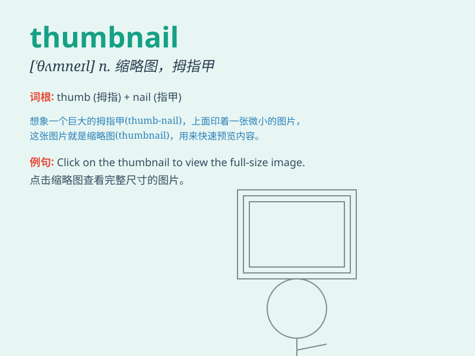

## thumbnail

**英音:** _[\'θʌmneɪl]_ **美音:** _[\'θʌmnel]_

**译义:** *n.拇指甲,极小的东西adj.极小的,极短的*

### 短语

+ **thumbnail image:** _缩略图图像_

+ **thumbnail gallery:** _缩略图库_

+ **thumbnail preview:** _缩略图预览_

+ **create thumbnail:** _创建缩略图_

+ **display thumbnail:** _显示缩略图_

### 例句

#### 例句1

> **The thumbnail of the video gave a preview of the exciting
content.**

**中文翻译:** 这个视频的缩略图提供了令人兴奋内容的预览。

**单词释义:** 缩略图

#### 例句2

> **She clicked on the thumbnail to view the full-sized image.**

**中文翻译:** 她点击缩略图以查看全尺寸的图像。

**单词释义:** 缩略图

#### 例句3

> **The website displayed thumbnails of various products for easy
browsing.**

**中文翻译:** 该网站展示了各种产品的缩略图以便于浏览。

**单词释义:** 缩略图

### 背诵小故事

>
想象一下，你正在翻阅一本厚厚的相册。突然，你看到一些小小的图片，它们就像拇指指甲（thumbnail）一样小，却能让你快速了解整页照片的大致内容。这些小图就是
thumbnail ，是不是很好记？

**想象翻阅相册看到像拇指指甲般小的图片能快速了解内容来记住 thumbnail
这个单词**

### 图义

