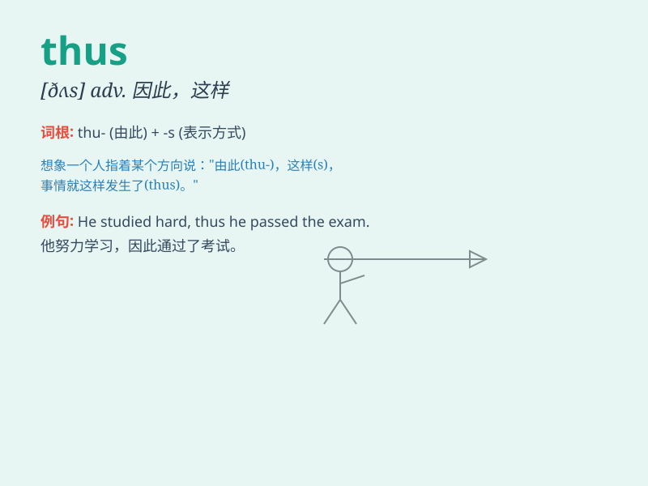

## thus

**英音:** _[ðʌs]_ **美音:** _[ðʌs]_

**译义:** *adv.因而,从而,这样,如此*

### 短语

+ **thus far:** _到目前为止；迄今_

+ **thus much:** _这么多；到这里为止_

+ **and thus:** _因此；从而_

+ **thus and thus:** _如此这般_

+ **thus it was:** _事情就是这样_

### 例句

#### 例句1

> **He worked hard and thus passed the exam.**

**中文翻译:** 他学习努力，因此通过了考试。

**单词释义:** 因此；从而

#### 例句2

> **The new machine operates more efficiently and thus reduces
costs.**

**中文翻译:** 新机器运行效率更高，从而降低了成本。

**单词释义:** 从而；所以

#### 例句3

> **She is very talented. Thus, she has many opportunities.**

**中文翻译:** 她非常有才华。因此，她有很多机会。

**单词释义:** 因此；于是

### 背诵小故事

> A brave knight was on a quest. He faced many challenges but always
chose the right path. Thus, he found the hidden treasure and became a
hero. The word \'thus\' here shows the result of his wise decisions.

**一位勇敢的骑士正在进行探索。他面临许多挑战，但总是选择正确的道路。因此，他找到了隐藏的宝藏并成为了英雄。这里的"thus"这个词显示了他明智决定的结果。**

### 图义

