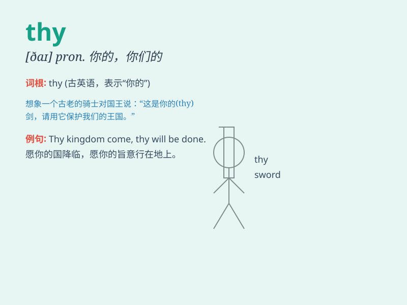

## thy

**英音:** _[ðaɪ]_ **美音:** _[ðaɪ]_

**译义:** * pron.\<古>(thou的所有格)你的*

### 短语

+ **thy will:** _你的意愿_

+ **thy name:** _你的名字_

+ **thy love:** _你的爱_

+ **thy hand:** _你的手_

+ **thy heart:** _你的心_

### 例句

#### 例句1

> **Honor thy father and thy mother.**

**中文翻译:** 要尊敬你的父亲和母亲。

**单词释义:** 你的（古英语或诗歌中使用）

#### 例句2

> **Thy kingdom come, Thy will be done.**

**中文翻译:** 愿你的国降临，愿你的旨意行在地上。

**单词释义:** 你的（古英语或诗歌中使用）

#### 例句3

> **Thy beauty is beyond compare.**

**中文翻译:** 你的美丽无与伦比。

**单词释义:** 你的（古英语或诗歌中使用）

### 背诵小故事

> In a magical kingdom, a fairy always said \'thy heart shall be filled
with joy\' when granting wishes. \'Thy\' here means \'your\' and shows a
special and old-fashioned way of addressing someone. So, remember, when
the fairy says \'thy\', she means \'your\'!

**在一个神奇的王国里，一个仙女在赐予愿望时总是说'你的心将充满喜悦'。这里的'thy'意思是'你的'，展现了一种特别且古老的称呼方式。所以，记住，当仙女说'thy'时，她的意思是'你的'！**

### 图义

