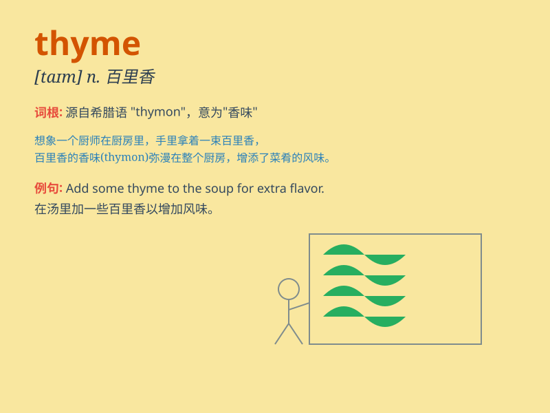

## thyme

**英音:** _[taɪm]_ **美音:** _[taɪm]_

**译义:** *n.麝香草属的植物,[植]百里香*

### 短语

+ **wild thyme:** _野百里香_

+ **thyme oil:** _百里香油_

+ **common thyme:** _普通百里香_

+ **thyme tea:** _百里香茶_

+ **thyme honey:** _百里香蜂蜜_

### 例句

#### 例句1

> **I added some thyme to the soup for extra flavor.**

**中文翻译:** 我往汤里加了一些百里香来增添风味。

**单词释义:** 百里香（一种香草）

#### 例句2

> **The garden is filled with thyme and other herbs.**

**中文翻译:** 花园里种满了百里香和其他香草。

**单词释义:** 百里香（植物）

#### 例句3

> **Thyme is often used in Mediterranean cuisine.**

**中文翻译:** 百里香常用于地中海美食。

**单词释义:** 百里香（用于烹饪）

### 背诵小故事

> A little rabbit was lost in a forest. It smelled a wonderful
fragrance and followed it. Finally, it found a patch of thyme. The
rabbit was so happy as the thyme was like a guide leading it to a
beautiful place.

**一只小兔子在森林里迷路了。它闻到一股美妙的香味，便顺着味道走。最后，它发现了一片百里香。小兔子非常高兴，因为百里香就像一个向导，把它带到了一个美丽的地方。**

### 图义

