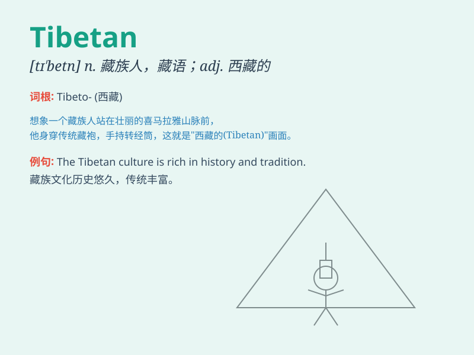

## Tibetan

**英音:** _[tɪˈbetn]_ **美音:** _[tɪˈbetn]_

**译义:** *n. 藏语；藏族人 adj. 藏语的；藏族的*

### 短语

+ **Tibetan Buddhism:** _藏传佛教_

+ **Tibetan Mastiff:** _藏獒_

+ **Tibetan language:** _藏语_

+ **Tibetan culture:** _藏族文化_

+ **Tibetan plateau:** _青藏高原_

### 例句

#### 例句1

> **The Tibetan culture is rich and diverse.**

**中文翻译:** 藏族文化丰富多样。

**单词释义:** 藏族的；西藏的

#### 例句2

> **She is interested in Tibetan Buddhism.**

**中文翻译:** 她对藏传佛教感兴趣。

**单词释义:** 藏族的；西藏的

#### 例句3

> **Tibetan artworks are highly valued.**

**中文翻译:** 藏族艺术品价值很高。

**单词释义:** 藏族的；西藏的

### 背诵小故事

> One day, I met a friendly Tibetan guy. He wore beautiful traditional
clothes and showed me around his hometown. I learned a lot about the
unique Tibetan culture. Remember, \'Tibetan\' refers to people or things
related to Tibet.

**有一天，我遇到了一个友好的藏族人。他穿着漂亮的传统服饰，并带我参观了他的家乡。我了解了很多独特的藏族文化。记住，\'Tibetan\'指的是与西藏有关的人或事物。**

### 图义

