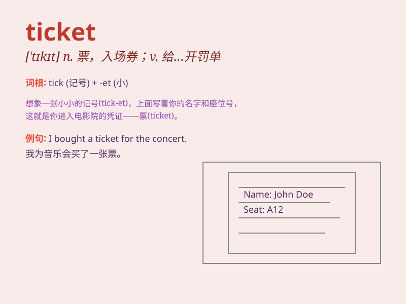

## ticket

**英音:** _[\'tɪkɪt]_ **美音:** _[\'tɪkɪt]_

**译义:** *n.票,入场券*

### 短语

+ **air ticket:** _飞机票_

+ **train ticket:** _火车票_

+ **bus ticket:** _公交车票_

+ **ticket office:** _售票处_

+ **lottery ticket:** _彩票_

### 例句

#### 例句1

> **I bought a ticket for the concert.**

**中文翻译:** 我买了一张音乐会的票。

**单词释义:** 票；入场券

#### 例句2

> **The police gave him a ticket for speeding.**

**中文翻译:** 警察因为他超速给他开了一张罚单。

**单词释义:** 罚单

#### 例句3

> **You need a ticket to enter the museum.**

**中文翻译:** 你需要一张票才能进入博物馆。

**单词释义:** 票；入场券

### 背诵小故事

> One day, I was very excited to go to a concert. But I couldn\'t enter
without a ticket. I finally got the ticket and enjoyed the wonderful
music. The ticket was my pass to happiness.

**有一天，我非常兴奋地想去一场音乐会。但没有票我进不去。最后我拿到了票，享受了美妙的音乐。这张票是我通往快乐的通行证。**

### 图义

