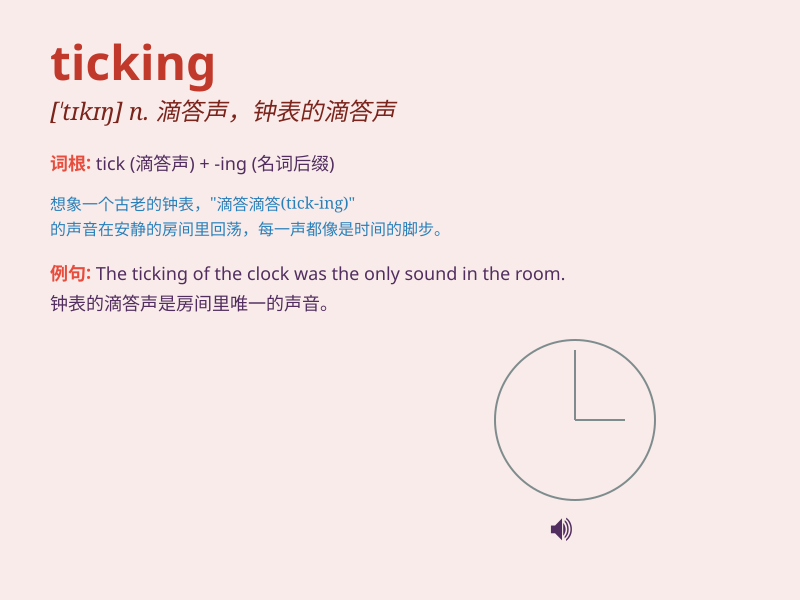

## ticking

**英音:** _[\'tɪkɪŋ]_ **美音:** _[\'tɪkɪŋ]_

**译义:** *n.被套料*

### 短语

+ **ticking time bomb:** _定时炸弹_

+ **keep ticking:** _继续运转；持续进行_

+ **ticking clock:** _滴答作响的时钟_

+ **ticking off:** _斥责；责备_

+ **ticking fabric:** _有条纹的织物_

### 例句

#### 例句1

> **The clock\'s ticking was very loud in the quiet room.**

**中文翻译:** 在安静的房间里，时钟的滴答声非常响亮。

**单词释义:** （钟表等的）滴答声

#### 例句2

> **She could hear the ticking of her watch as she waited
nervously.**

**中文翻译:** 她紧张地等待时能听到手表的滴答声。

**单词释义:** （钟表等的）滴答声

#### 例句3

> **The bomb was set with a ticking timer.**

**中文翻译:** 炸弹被设置了一个滴答作响的定时器。

**单词释义:** （定时器等的）滴答声

### 背诵小故事

> I was in a quiet room, and the only sound was the ticking of the
clock. It was like a reminder that time was passing. The ticking was
steady and never stopped. It made me think of how we should cherish
every moment.

**我在一个安静的房间里，唯一的声音是时钟的滴答声。它就像在提醒时间在流逝。滴答声平稳且从未停止。这让我想到我们应该珍惜每一刻。**

### 图义

