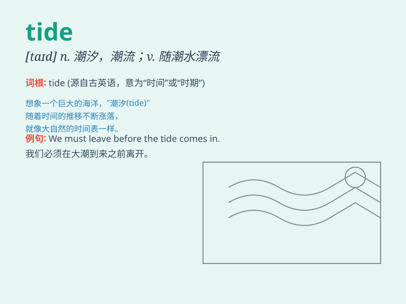

## tide

**英音:** _[taɪd]_ **美音:** _[taɪd]_

**译义:** *n.潮,潮汐,潮流,趋势*

### 短语

+ **tide over:** _帮助...渡过难关_

+ **ebb tide:** _退潮；落潮_

+ **flood tide:** _涨潮；洪水_

+ **turn the tide:** _扭转局势；转变运气_

+ **swim against the tide:** _逆潮流而动；反潮流_

### 例句

#### 例句1

> **The tide is coming in.**

**中文翻译:** 潮水正在上涨。

**单词释义:** 潮水

#### 例句2

> **She swam against the tide.**

**中文翻译:** 她逆着潮流游泳。

**单词释义:** 潮流

#### 例句3

> **The political tide has turned.**

**中文翻译:** 政治潮流已经转变。

**单词释义:** 潮流；趋势

### 背诵小故事

> A man was lost at the beach. The tide kept coming in and out. When
the tide was in, he had to move higher. When it was out, he could search
for shells. Finally, he learned to predict the tide and stay safe.

**一个男人在海滩迷路了。潮水不断地涨落。涨潮时，他不得不往高处走。退潮时，他可以寻找贝壳。最后，他学会了预测潮水并保证安全。**

### 图义

