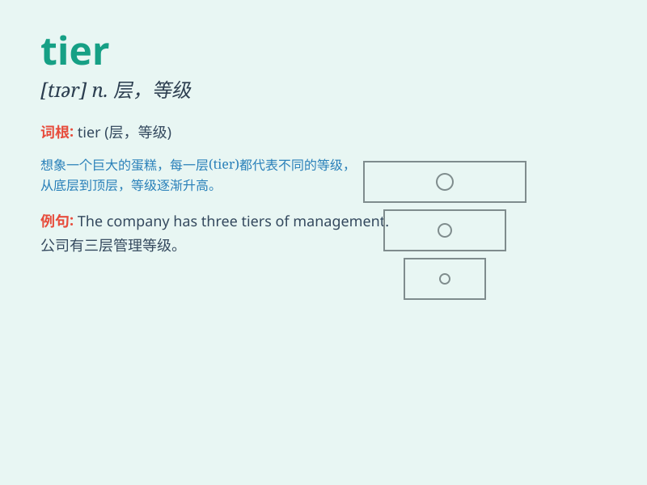

## tier

**英音:** _[tɪə]_ **美音:** _[tɪr]_

**译义:**
*n.列,行,排,层,等级vt.使造成递升排列,使层叠vi.成递升徘列*

### 短语

+ **lower tier:** _较低层级_

+ **top tier:** _顶层；最高层级_

+ **tier list:** _层级列表_

+ **tier system:** _层级制度_

+ **middle tier:** _中层级_

### 例句

#### 例句1

> **The wedding cake had three tiers.**

**中文翻译:** 这个婚礼蛋糕有三层。

**单词释义:** 层；级

#### 例句2

> **The football team is in the top tier of the league.**

**中文翻译:** 这支足球队处于联赛的顶级梯队。

**单词释义:** 梯队；等级

#### 例句3

> **The seats in the stadium are arranged in tiers.**

**中文翻译:** 体育场的座位是分层排列的。

**单词释义:** 排；层

### 背诵小故事

>
想象一个巨大的婚礼蛋糕，它被分成了好几层（tiers）。最上面那层放着精美的小雕像，下面的层则摆满了美味的水果和花朵。这一层层的蛋糕，就像
tier 所表示的'层，级'。

**想象一个婚礼蛋糕被分层，帮助理解 tier 表示'层，级'的意思。**

### 图义

