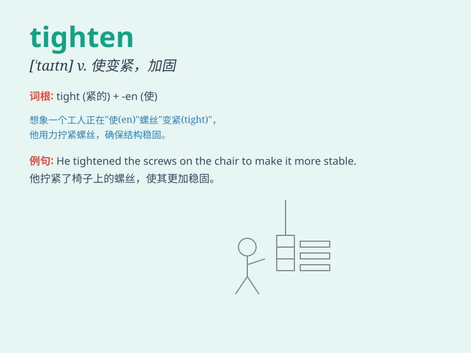

## tighten

**英音:** _[\'taɪt(ə)n]_ **美音:** _[\'taɪtn]_

**译义:** *v.变紧,绷紧,拉紧*

### 短语

+ **tighten the screw:** _拧紧螺丝_

+ **tighten one\'s belt:** _勒紧裤带（省吃俭用）_

+ **tighten control:** _加强控制_

+ **tighten security:** _加强安全措施_

+ **tighten up:** _使更严格；加强_

### 例句

#### 例句1

> **He tightened the screw with a screwdriver.**

**中文翻译:** 他用螺丝刀把螺丝拧紧了。

**单词释义:** 拧紧

#### 例句2

> **The government is planning to tighten security measures.**

**中文翻译:** 政府正计划加强安全措施。

**单词释义:** 加强

#### 例句3

> **She tightened her grip on the handle.**

**中文翻译:** 她紧紧握住把手。

**单词释义:** 握紧

### 背诵小故事

> A man was trying to fix a loose chair. He used a wrench to tighten
the screws. With each turn, the chair became more stable. Finally, it
was nice and firm, just like when we tighten something to make it
secure.

**一个男人正在试图修理一把松动的椅子。他用扳手拧紧螺丝。每拧一下，椅子就变得更稳固。最后，它变得又好又牢固，就像我们拧紧某物使其稳固一样。**

### 图义

