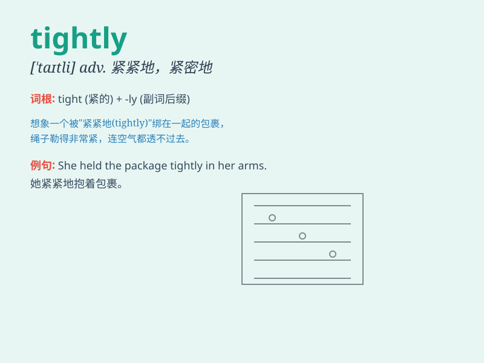

## tightly

**英音:** _[\'taɪtlɪ]_ **美音:** _[\'taɪtli]_

**译义:** *adv.紧紧地,坚固地*

### 短语

+ **tightly closed:** _紧闭的_

+ **tightly wound:** _神经紧张的；心情焦躁的_

+ **tightly held:** _紧紧握住的_

+ **tightly packed:** _包装严实的；紧密包装的_

+ **tightly controlled:** _严格控制的_

### 例句

#### 例句1

> **She held the baby tightly in her arms.**

**中文翻译:** 她紧紧地把婴儿抱在怀里。

**单词释义:** 紧紧地

#### 例句2

> **The rope was tied tightly around the pole.**

**中文翻译:** 绳子紧紧地绑在杆子上。

**单词释义:** 紧紧地

#### 例句3

> **He shut the door tightly to keep out the cold wind.**

**中文翻译:** 他紧紧地关上门以阻挡冷风。

**单词释义:** 紧紧地

### 背诵小故事

> A little mouse was running in the dark cave. It held a precious gem
tightly in its paws, afraid that it might drop. Suddenly, a gust of wind
blew, but the mouse still held the gem tightly and finally reached its
home safely.

**一只小老鼠在黑暗的洞穴里奔跑。它的爪子紧紧地握着一颗珍贵的宝石，生怕掉落。突然，一阵风吹来，但老鼠仍然紧紧地握着宝石，最终安全地回到了家。**

### 图义

