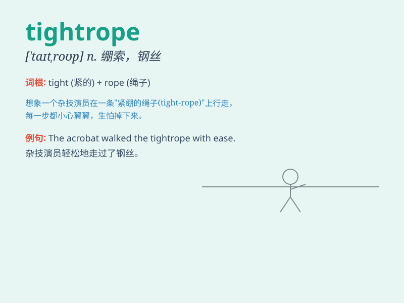

## tightrope

**英音:** _[\'taɪtrəʊp]_ **美音:** _[\'taɪtrop]_

**译义:** *n.拉紧的绳索*

### 短语

+ **walk the tightrope:** _走钢丝_

+ **tightrope act:** _走钢丝表演_

+ **tightrope walker:** _走钢丝者_

+ **balance on a tightrope:** _在钢丝上保持平衡_

+ **perform a tightrope stunt:** _表演走钢丝绝技_

### 例句

#### 例句1

> **The acrobat walked the tightrope with amazing balance.**

**中文翻译:** 这位杂技演员以惊人的平衡能力在钢丝上行走。

**单词释义:** 钢丝

#### 例句2

> **He\'s been on a tightrope since he took on that difficult
project.**

**中文翻译:** 自从他承担那个困难的项目以来，他一直如履薄冰。

**单词释义:** 危险的处境

#### 例句3

> **Life is sometimes like walking on a tightrope; you have to be
careful at every step.**

**中文翻译:** 生活有时就像走钢丝，每一步都得小心翼翼。

**单词释义:** 钢丝

### 背诵小故事

> A brave acrobat was walking on a tightrope high above the ground.
Everyone held their breath as he balanced carefully. The tightrope was
thin and difficult to stay on, but he didn\'t give up.

**一位勇敢的杂技演员在高高的空中走钢丝。当他小心翼翼地保持平衡时，所有人都屏住了呼吸。钢丝又细又难站稳，但他没有放弃。**

### 图义

