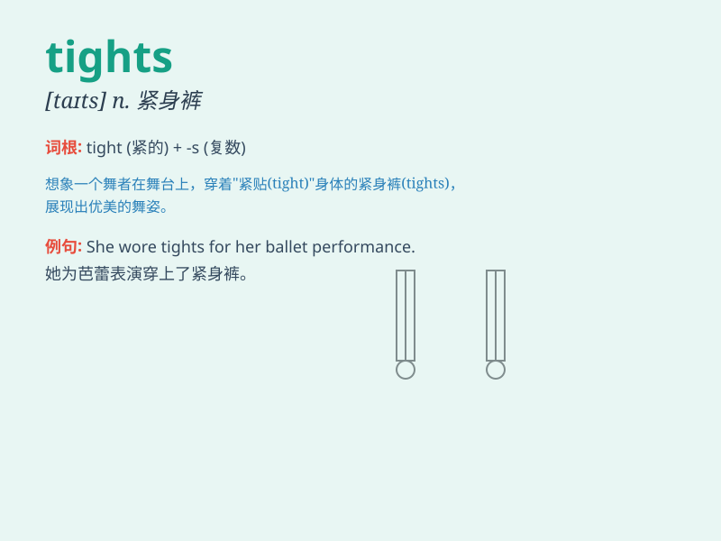

## tights

**英音:** _[taɪts]_ **美音:** _[taɪts]_

**译义:** *n.贴身衬衣,紧身衣*

### 短语

+ **wear tights:** _穿紧身裤_

+ **thick tights:** _厚紧身裤_

+ **black tights:** _黑色紧身裤_

+ **opaque tights:** _不透明的紧身裤_

+ **thermal tights:** _保暖紧身裤_

### 例句

#### 例句1

> **She wore black tights and a short skirt.**

**中文翻译:** 她穿着黑色的紧身裤和一条短裙。

**单词释义:** 紧身裤

#### 例句2

> **The dancer changed into a new pair of tights before going on
stage.**

**中文翻译:** 这位舞蹈演员在上台前换上了一双新的紧身裤。

**单词释义:** 紧身裤

#### 例句3

> **I need to buy some thick tights for the winter.**

**中文翻译:** 我需要为冬天买一些厚的紧身裤。

**单词释义:** 紧身裤

### 背诵小故事

> Alice was going to a party. She wore a beautiful dress and a pair of
tights. But on the way, she accidentally tore her tights. Luckily, she
had a spare pair and still looked amazing at the party.

**爱丽丝要去参加一个聚会。她穿着漂亮的裙子和一条连裤袜。但在路上，她不小心把连裤袜撕破了。幸运的是，她有备用的，在聚会上仍然看起来美极了。**

### 图义

