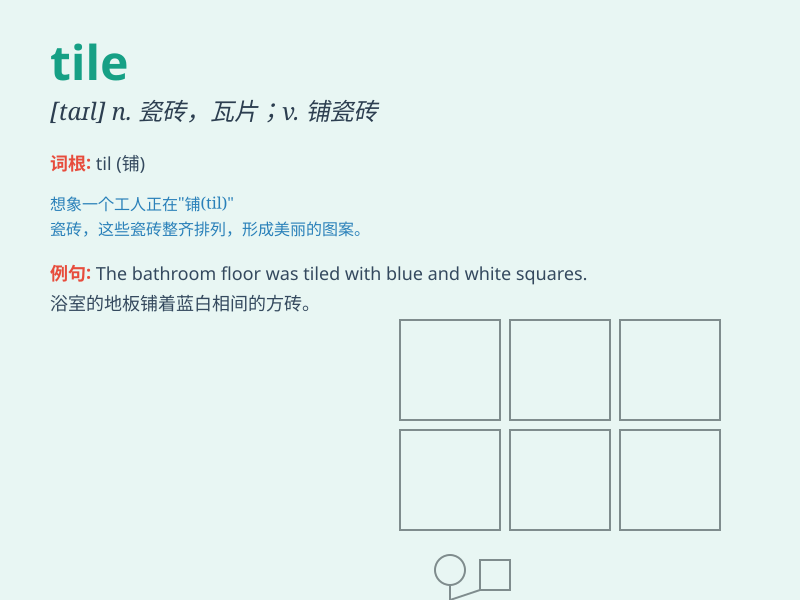

## tile

**英音:** _[taɪl]_ **美音:** _[taɪl]_

**译义:** *n.瓦片,瓷砖*

### 短语

+ **ceramic tile:** _瓷砖_

+ **floor tile:** _地砖_

+ **roof tile:** _屋瓦_

+ **tile floor:** _瓷砖地面_

+ **tile roof:** _瓦屋顶_

### 例句

#### 例句1

> **The bathroom floor is covered with ceramic tiles.**

**中文翻译:** 浴室的地板铺满了瓷砖。

**单词释义:** 瓷砖

#### 例句2

> **She was tiling the kitchen wall.**

**中文翻译:** 她正在给厨房的墙贴瓷砖。

**单词释义:** 给\...铺瓷砖

#### 例句3

> **The roof was made of red tiles.**

**中文翻译:** 屋顶是用红色的瓦片做成的。

**单词释义:** 瓦片

### 背诵小故事

> One day, Tom was helping his father lay tiles on the floor. The tiles
were colorful and shiny. Tom carefully placed each tile to make the
floor beautiful. It was a hard but interesting job.

**一天，汤姆正在帮他父亲在地板上铺瓷砖。瓷砖五颜六色且闪闪发亮。汤姆仔细地放置每一块瓷砖以使地板漂亮。这是一项辛苦但有趣的工作。**

### 图义

