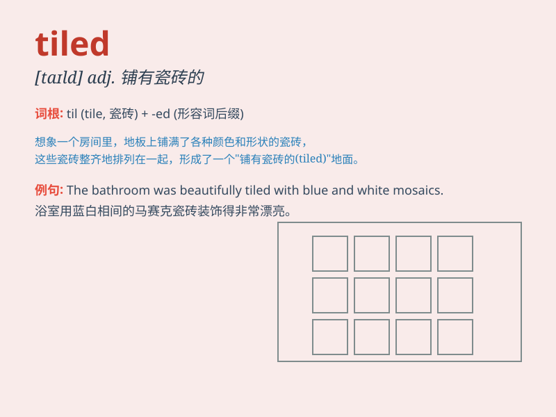

## tiled

**英音:** _[taɪld]_ **美音:** _[taɪld]_

**译义:** *adj.平铺的,用瓦管排水的*

### 短语

+ **tiled floor:** _瓷砖地板_

+ **tiled roof:** _瓦屋顶_

+ **tiled bathroom:** _铺瓷砖的浴室_

+ **tiled wall:** _贴瓷砖的墙_

+ **tiled swimming pool:** _铺瓷砖的游泳池_

### 例句

#### 例句1

> **The bathroom floor is tiled with blue ceramic tiles.**

**中文翻译:** 浴室的地板用蓝色的瓷砖铺成。

**单词释义:** 用瓷砖覆盖

#### 例句2

> **The roof was tiled in red.**

**中文翻译:** 屋顶用红色的瓦片铺盖着。

**单词释义:** 用瓦片覆盖

#### 例句3

> **The swimming pool area is beautifully tiled.**

**中文翻译:** 游泳池区域铺着漂亮的瓷砖。

**单词释义:** 铺瓷砖

### 背诵小故事

> A little mouse was running in a house with tiled floors. It slipped
on the smooth tiles. But then it learned to walk carefully. Remember,
\'tiled\' means having tiles!

**一只小老鼠在铺有瓷砖的房子里跑。它在光滑的瓷砖上滑倒了。但后来它学会了小心走路。记住，\'tiled\'意思是铺有瓷砖的！**

### 图义

