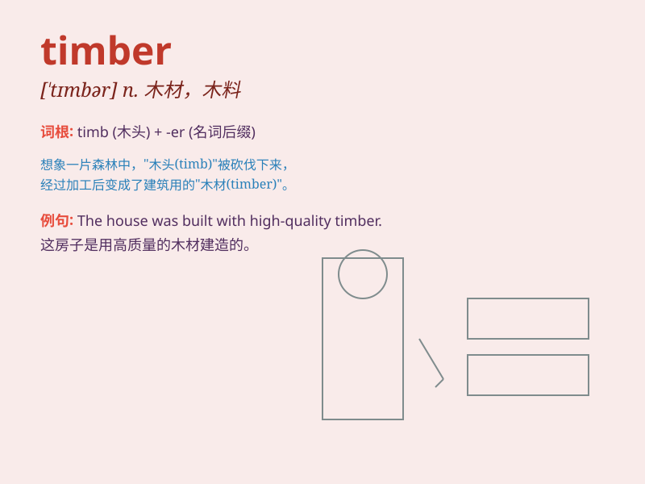

## timber

**英音:** _[\'tɪmbə]_ **美音:** _[\'tɪmbɚ]_

**译义:** *n.木材,木料*

### 短语

+ **timber frame:** _木构架_

+ **timber wolf:** _大灰狼；林狼_

+ **standing timber:** _立木_

+ **timber yard:** _木材场_

+ **timber industry:** _木材工业_

### 例句

#### 例句1

> **The timber was used to build the house.**

**中文翻译:** 这些木材被用来建造房屋。

**单词释义:** 木材

#### 例句2

> **The workers are transporting the timber to the factory.**

**中文翻译:** 工人们正在把木材运往工厂。

**单词释义:** 木材

#### 例句3

> **The storm brought down a lot of timber.**

**中文翻译:** 暴风雨刮倒了许多树木（木材）。

**单词释义:** 树木（木材）

### 背诵小故事

> A brave lumberjack was cutting down trees in the forest. The wood
from these trees is called timber. He carefully selected the best timber
to build a warm house for his family.

**一位勇敢的伐木工在森林里砍树。这些树的木材被称为
timber。他精心挑选最好的木材为家人建造温暖的房子。**

### 图义

