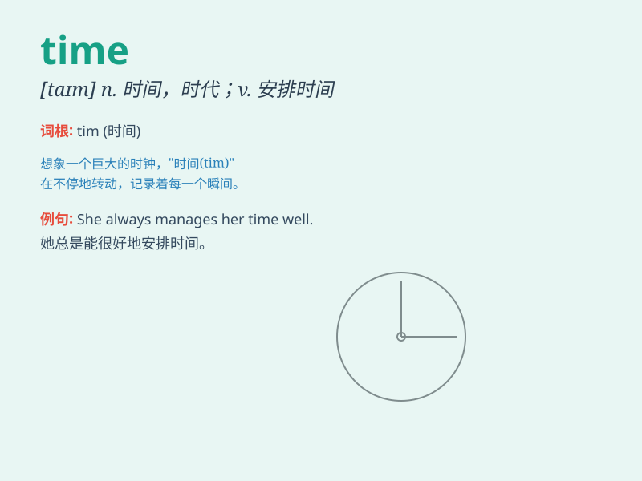

## time

**英音:** _[taɪm]_ **美音:** _[taɪm]_

**译义:**
*n.时间,时侯,时机,节拍,期限,次数,时期,比赛限时vt.安排\...的时间,记录\...的时间,计时,定时vi.打拍子,(\...)合拍adj.时间的,记时的,定时的,定期的,分期的
/n.时间/日期*

### 短语

+ **all the time:** _一直；始终_

+ **at the same time:** _同时；然而_

+ **from time to time:** _不时；有时_

+ **in no time:** _立刻；马上_

+ **on time:** _准时；按时_

### 例句

#### 例句1

> **I don\'t have much time to finish this project.**

**中文翻译:** 我没有太多时间来完成这个项目。

**单词释义:** 时间

#### 例句2

> **It\'s time for lunch.**

**中文翻译:** 该吃午饭了。

**单词释义:** 时候；时刻

#### 例句3

> **She always times her runs perfectly.**

**中文翻译:** 她总是能精准地计算自己跑步的时间。

**单词释义:** 计时；测定\...的时间

### 背诵小故事

> One day, a little rabbit was always late. Its friends asked why. The
rabbit said it couldn\'t tell the right time. So it decided to learn to
read the clock. From then on, it knew time well and was never late
again.

**有一天，一只小兔子总是迟到。它的朋友们问为什么。兔子说它分不清正确的时间。所以它决定学习看时钟。从那以后，它很好地掌握了时间，再也没有迟到过。**

### 图义

