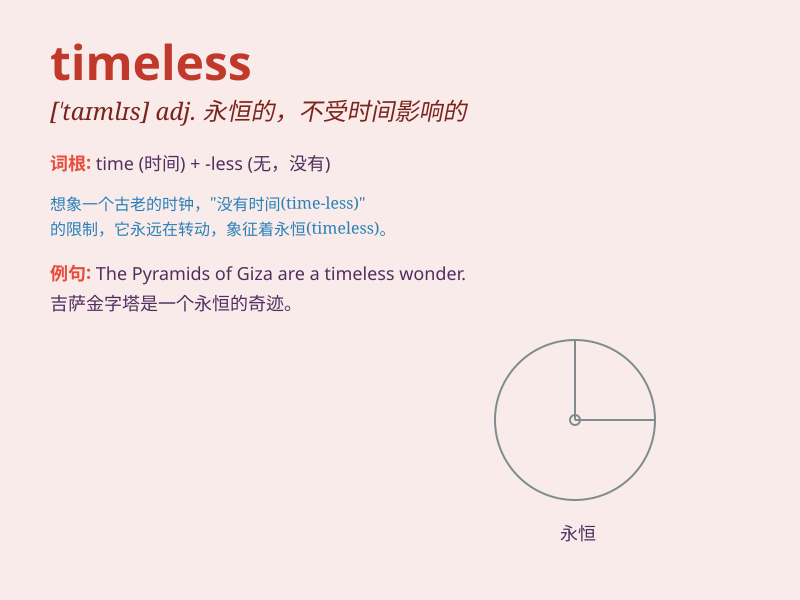

## timeless

**英音:** _[\'taɪmlɪs]_ **美音:** _[\'taɪmləs]_

**译义:** *adj.永恒的*

### 短语

+ **timeless beauty:** _永恒的美_

+ **timeless classic:** _永恒的经典_

+ **timeless design:** _永恒的设计_

+ **timeless charm:** _永恒的魅力_

+ **timeless wisdom:** _永恒的智慧_

### 例句

#### 例句1

> **The beauty of this ancient temple is timeless.**

**中文翻译:** 这座古老寺庙的美是永恒的。

**单词释义:** 永恒的

#### 例句2

> **Her music has a timeless quality that appeals to people of all
ages.**

**中文翻译:** 她的音乐有一种永恒的特质，吸引着各个年龄段的人。

**单词释义:** 永恒的；不受时间影响的

#### 例句3

> **The story of Romeo and Juliet is a timeless tragedy.**

**中文翻译:** 罗密欧与朱丽叶的故事是一个永恒的悲剧。

**单词释义:** 永恒的；永远的

### 背诵小故事

> A time traveler got lost in a strange world where time seemed
timeless. There was no day or night, and everything remained unchanged.
This experience made him understand the meaning of \'timeless\'.

**一位时间旅行者在一个奇怪的世界里迷路了，在那里时间似乎是永恒的。没有白天或黑夜，一切都保持不变。这次经历让他明白了\'timeless\'的含义。**

### 图义

