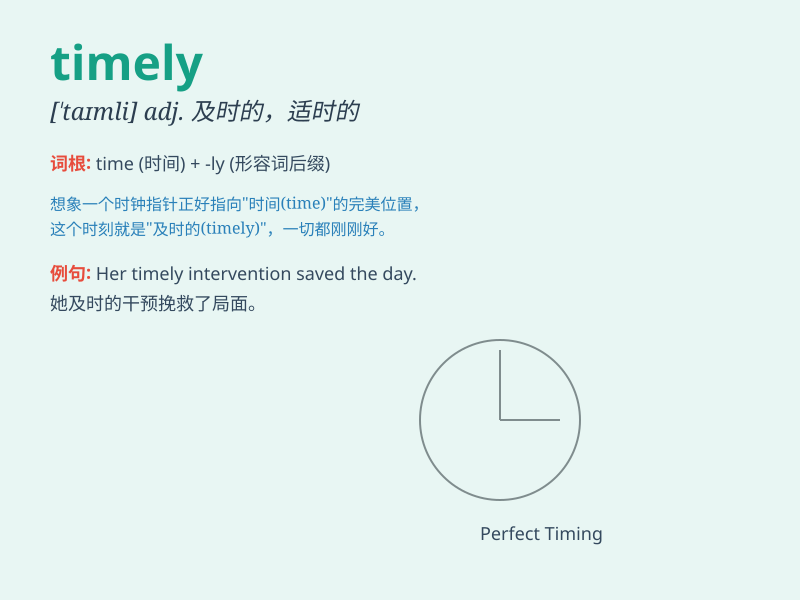

## timely

**英音:** _[\'taɪmlɪ]_ **美音:** _[\'taɪmli]_

**译义:** *adj.及时的,适时的*

### 短语

+ **timely manner:** _及时的方式_

+ **timely reminder:** _及时的提醒_

+ **timely intervention:** _及时的干预_

+ **timely delivery:** _及时交付_

+ **timely decision:** _及时的决定_

### 例句

#### 例句1

> **The doctor\'s intervention was timely and saved the patient\'s
life.**

**中文翻译:** 医生的干预很及时，挽救了病人的生命。

**单词释义:** 及时的

#### 例句2

> **A timely reminder helped me avoid making a big mistake.**

**中文翻译:** 一个及时的提醒帮助我避免了犯一个大错误。

**单词释义:** 及时的

#### 例句3

> **The company\'s decision to expand was timely given the market
conditions.**

**中文翻译:** 鉴于市场情况，公司扩张的决定是及时的。

**单词释义:** 及时的

### 背诵小故事

> A doctor\'s timely arrival saved the patient\'s life. The doctor came
just in time and gave the right treatment. \'Timely\' means happening at
the right or suitable time, like the doctor\'s appearance.

**一位医生的及时到来挽救了病人的生命。医生来得正是时候并给予了正确的治疗。\'timely\'意思是在恰当或合适的时间发生，就像医生的出现。**

### 图义

