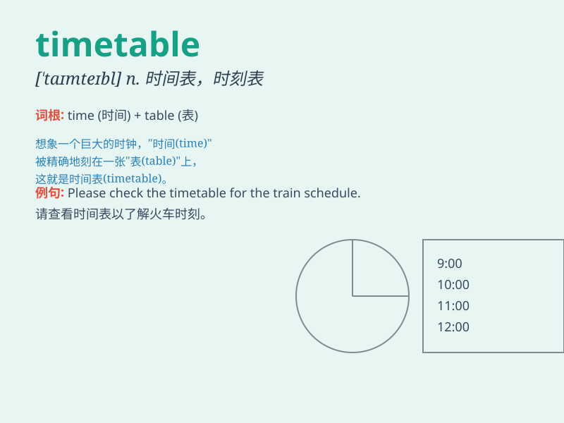

## timetable

**英音:** _[\'taɪmteɪb(ə)l]_ **美音:** _[\'taɪm\'tebl]_

**译义:** *n.时间表*

### 短语

+ **school timetable:** _学校课程表_

+ **train timetable:** _火车时刻表_

+ **bus timetable:** _公交车时刻表_

+ **flight timetable:** _航班时刻表_

+ **weekly timetable:** _周时间表_

### 例句

#### 例句1

> **I need to check my timetable to see when my next class is.**

**中文翻译:** 我需要查看我的课程表来看看我下节课是什么时候。

**单词释义:** 课程表；时间表

#### 例句2

> **The train timetable has changed due to the bad weather.**

**中文翻译:** 由于恶劣天气，火车时刻表已经改变了。

**单词释义:** 时刻表

#### 例句3

> **She always follows her daily timetable strictly.**

**中文翻译:** 她总是严格遵循她的每日时间表。

**单词释义:** 时间表

### 背诵小故事

> One day, Tom was always late for school. His teacher gave him a
timetable to follow. With it, Tom knew exactly when each class started
and ended. Now he was never late again!

**一天，汤姆总是上学迟到。他的老师给了他一张时间表。有了它，汤姆确切地知道每节课什么时候开始和结束。现在他再也不迟到了！**

### 图义

