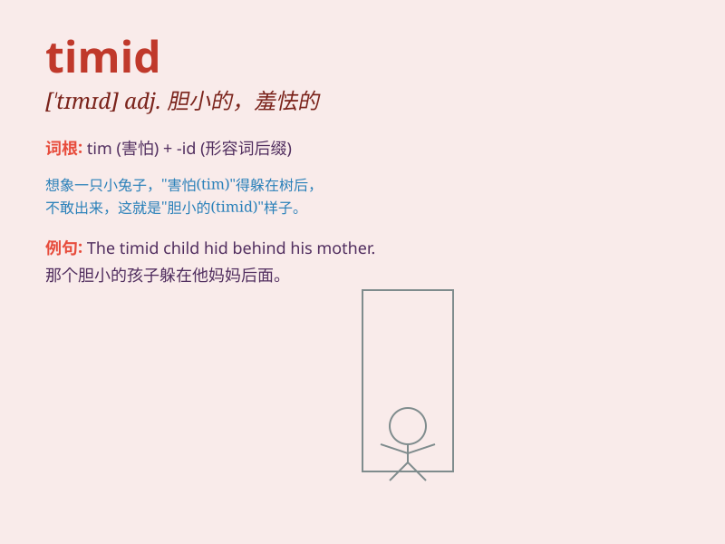

## timid

**英音:** _[\'tɪmɪd]_ **美音:** _[\'tɪmɪd]_

**译义:** *adj.胆小的,羞怯的*

### 短语

+ **timid nature:** _胆小的天性_

+ **timid smile:** _羞怯的微笑_

+ **be timid of:** _害怕；对\...\...胆怯_

+ **timid approach:** _胆怯的方式_

+ **timid attempt:** _胆小的尝试_

### 例句

#### 例句1

> **She is too timid to speak in public.**

**中文翻译:** 她太胆小了，不敢在公众面前讲话。

**单词释义:** 胆小的

#### 例句2

> **The timid child hid behind his mother.**

**中文翻译:** 那个胆小的孩子躲在他妈妈身后。

**单词释义:** 胆小的；羞怯的

#### 例句3

> **Don\'t be so timid. Just have a try!**

**中文翻译:** 别这么胆小。试一试！

**单词释义:** 胆小的；怯懦的

### 背诵小故事

> Once upon a time, there was a little mouse named Tim. Tim was always
very timid. When faced with a big cat, Tim would hide instead of being
brave. This shows what \'timid\' means - being shy and lacking courage.

**从前，有一只小老鼠叫蒂姆。蒂姆总是非常胆小。当面对一只大猫时，蒂姆会躲起来而不是勇敢面对。这就体现了\'timid\'这个词的意思------害羞且缺乏勇气。**

### 图义

