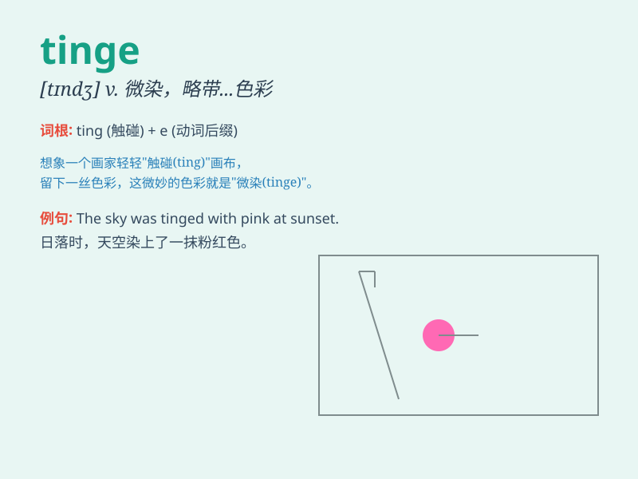

## tinge

**英音:** _[tɪn(d)ʒ]_ **美音:** _[tɪndʒ]_

**译义:** *n.淡色,色调,些微气味,气息,风味vt.微染,使带气息*

### 短语

+ **a tinge of sadness:** _一丝悲伤_

+ **tinge with colour:** _带有颜色_

+ **tinge of jealousy:** _一丝嫉妒_

+ **tinge of hope:** _一线希望_

+ **tinge the hair:** _给头发染色_

### 例句

#### 例句1

> **The sunset had a beautiful tinge of pink.**

**中文翻译:** 日落有着美丽的一抹粉色。

**单词释义:** 一抹，一丝（颜色）

#### 例句2

> **Her sadness gave a tinge of melancholy to her smile.**

**中文翻译:** 她的悲伤给她的笑容带来了一丝忧郁。

**单词释义:** 一点儿，少许（情感、特质）

#### 例句3

> **The white walls had a tinge of yellow from age.**

**中文翻译:** 白色的墙壁由于年代久远有了一点儿黄色。

**单词释义:** 轻微的色彩，色调

### 背诵小故事

> A painter was working on a landscape. He added a tinge of blue to the
sky to make it look more peaceful. Just a small tinge made a big
difference. The tinge was like a magic touch.

**一位画家正在创作一幅风景画。他给天空添加了一抹蓝色，让它看起来更宁静。仅仅一小抹就产生了很大的不同。这一抹就像是神奇的一笔。**

### 图义

