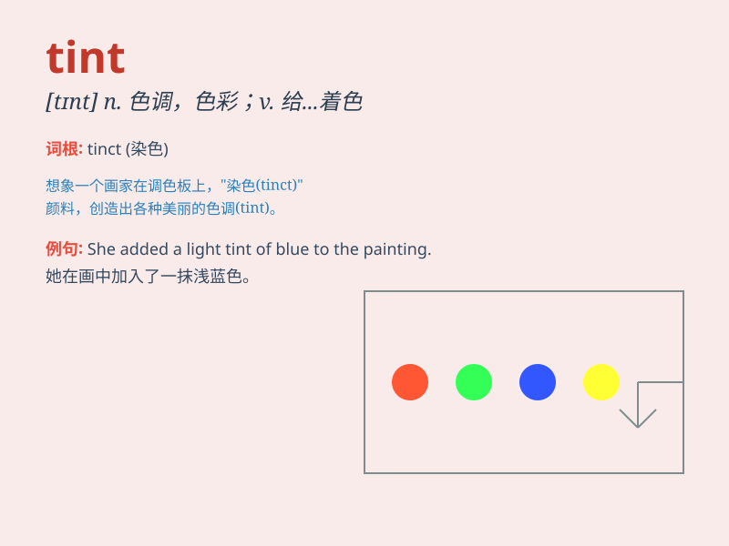

## tint

**英音:** _[tɪnt]_ **美音:** _[tɪnt]_

**译义:** *n.色彩*

### 短语

+ **hair tint:** _染发_

+ **tint shade:** _色调；色彩浓淡_

+ **tint color:** _染色；色彩_

+ **tint film:** _着色膜；彩色膜_

+ **tint mixture:** _调色混合物_

### 例句

#### 例句1

> **She gave her hair a tint of red.**

**中文翻译:** 她给头发染了一点红色。

**单词释义:** 给\...\...着色；染色

#### 例句2

> **The sunset tinted the sky orange and pink.**

**中文翻译:** 日落把天空染成了橙色和粉色。

**单词释义:** 使\...\...带上色彩；使\...\...略微着色

#### 例句3

> **These glasses have a tint to protect your eyes from the sun.**

**中文翻译:** 这些眼镜带有颜色以保护你的眼睛免受阳光伤害。

**单词释义:** （玻璃、镜片等的）色彩；色调

### 背诵小故事

> A painter was working on a beautiful landscape. He added a tint of
blue to the sky to make it more vivid. The tint changed the whole look
of the painting and made it even more charming.

**一位画家正在创作一幅美丽的风景画。他给天空添加了一抹蓝色，使其更加生动。这抹色彩改变了整幅画的样子，让它更具魅力。**

### 图义

