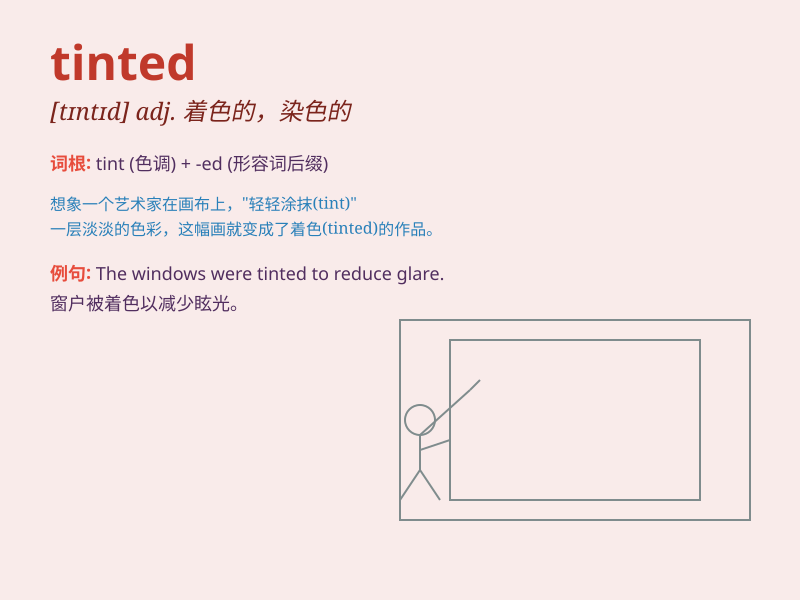

## tinted

**英音:** _[ˈtɪntɪd]_ **美音:** _[ˈtɪntɪd]_

**译义:** *adj.染色的；有色的；被着色的*

### 短语

+ **tinted glasses:** _有色眼镜_

+ **tinted lotion:** _有色乳液_

+ **tinted window:** _有色窗户_

+ **tinted hair:** _染色的头发_

+ **tinted lip balm:** _有色唇膏_

### 例句

#### 例句1

> **She wore tinted sunglasses to protect her eyes from the sun.**

**中文翻译:** 她戴着有色太阳镜以保护眼睛免受阳光伤害。

**单词释义:** 有色的

#### 例句2

> **The car windows were tinted to provide privacy.**

**中文翻译:** 汽车车窗被染色以提供隐私。

**单词释义:** 染色的

#### 例句3

> **His hair had a tinted hue after the dye job.**

**中文翻译:** 染发后他的头发有了一种带色的色调。

**单词释义:** 带色的

### 背诵小故事

> A girl tinted her hair pink for a party. But the tint wasn\'t
perfect. So she had to redo it. It means to give a slight color to
something.

**一个女孩为了聚会把头发染成了粉色。但染色效果不太好。所以她不得不重新染。这个单词意思是给某物轻微着色。**

### 图义

