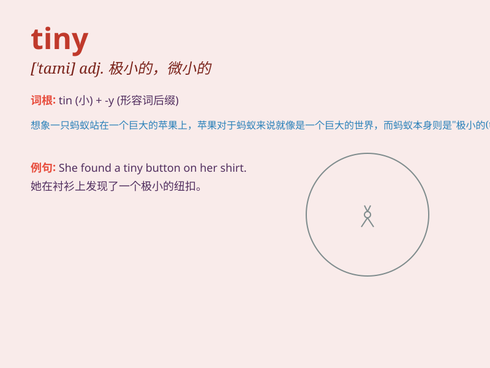

## tiny

**英音:** _[\'taɪnɪ]_ **美音:** _[\'taɪni]_

**译义:** *adj.很少的,微小的*

### 短语

+ **tiny baby:** _小婴儿_

+ **tiny room:** _小房间_

+ **tiny particle:** _微小颗粒_

+ **tiny insect:** _小昆虫_

+ **tiny amount:** _少量_

### 例句

#### 例句1

> **The baby\'s hands were tiny and delicate.**

**中文翻译:** 这个婴儿的手很小很娇嫩。

**单词释义:** 小的

#### 例句2

> **She lives in a tiny apartment in the city center.**

**中文翻译:** 她住在市中心的一个小公寓里。

**单词释义:** 小的

#### 例句3

> **The tiny flowers in the garden are very beautiful.**

**中文翻译:** 花园里的小花非常漂亮。

**单词释义:** 微小的

### 背诵小故事

> Once upon a time, there was a little ant. It was so tiny that it
could fit in the smallest hole. But even though it was tiny, it was very
brave and could carry food much heavier than itself.

**从前，有一只小蚂蚁。它非常小，小到可以钻进最小的洞里。但尽管它很小，却非常勇敢，能搬运比自身重得多的食物。**

### 图义

