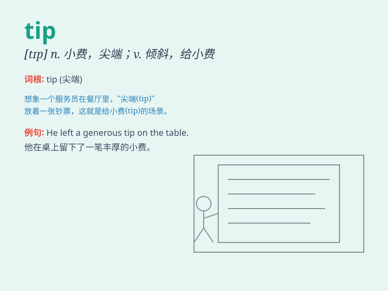

## tip

**英音:** _[tɪp]_ **美音:** _[tɪp]_

**译义:**
*n.顶,尖端,梢,倾斜,轻击,末端,小费,秘密消息vt.在\...顶端装附加物,使倾斜,使翻倒,暗示,轻击,给,泄露,给小费vi.倾斜,翻倒,倾覆,踮脚走,给小费n.提示,技巧*

### 短语

+ **tip off:** _向\...通风报信；暗中通知_

+ **tip over:** _（使）翻倒；（使）倾倒_

+ **tip the balance:** _使天平倾斜；起决定性作用_

+ **tip someone the wink:** _向某人使眼色；向某人暗示_

+ **the tip of the iceberg:** _冰山一角；事物的表面部分_

### 例句

#### 例句1

> **She gave me a useful tip on how to save money.**

**中文翻译:** 她给了我一个关于如何省钱的有用的建议。

**单词释义:** 建议；窍门

#### 例句2

> **The waitress received a generous tip from the customer.**

**中文翻译:** 这位女服务员从顾客那里得到了一笔丰厚的小费。

**单词释义:** 小费

#### 例句3

> **The tip of the pen is broken.**

**中文翻译:** 这支笔的笔尖坏了。

**单词释义:** 尖端；末梢

### 背诵小故事

> One day, I was carrying a heavy box. A kind stranger came and gave me
a tip: \'Lean to one side for better balance.\' I followed his advice
and it really helped. The tip was so useful!

**一天，我正搬着一个沉重的箱子。一个善良的陌生人过来给了我一个提示：'往一边倾斜会更好保持平衡。'我听从了他的建议，真的有帮助。这个提示太有用了！**

### 图义

