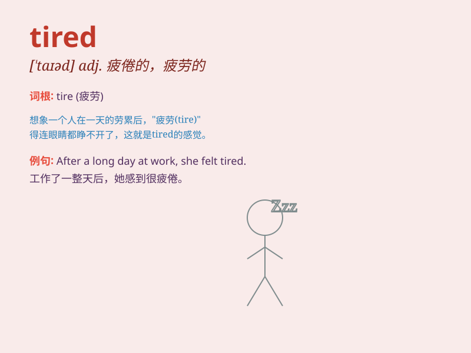

## tired

**英音:** _[taɪəd]_ **美音:** _[ˈtaɪrd]_

**译义:** *adj.疲劳的,累的,疲倦的*

### 短语

+ **be tired of:** _对\...\...感到厌倦_

+ **get tired:** _变得疲倦_

+ **tired out:** _筋疲力尽；十分疲劳_

+ **feel tired:** _感觉疲倦_

+ **dead tired:** _累得要命；精疲力竭_

### 例句

#### 例句1

> **I\'m so tired after a long day at work.**

**中文翻译:** 在工作了一整天之后，我感到非常疲倦。

**单词释义:** 疲倦的；累的

#### 例句2

> **The tired horse could hardly move.**

**中文翻译:** 这匹疲倦的马几乎走不动了。

**单词释义:** 疲劳的；乏力的

#### 例句3

> **She looked tired and sad.**

**中文翻译:** 她看上去又累又伤心。

**单词释义:** 困倦的；厌倦的

### 背诵小故事

> One day, Tom climbed a very high mountain. After a long and hard
journey, he felt extremely tired. His legs were heavy and he could
hardly move. He just wanted to find a place to rest.

**有一天，汤姆爬了一座很高的山。经过漫长而艰难的旅程，他感到极其疲倦。他的腿很沉重，几乎无法移动。他只想找个地方休息。**

### 图义

