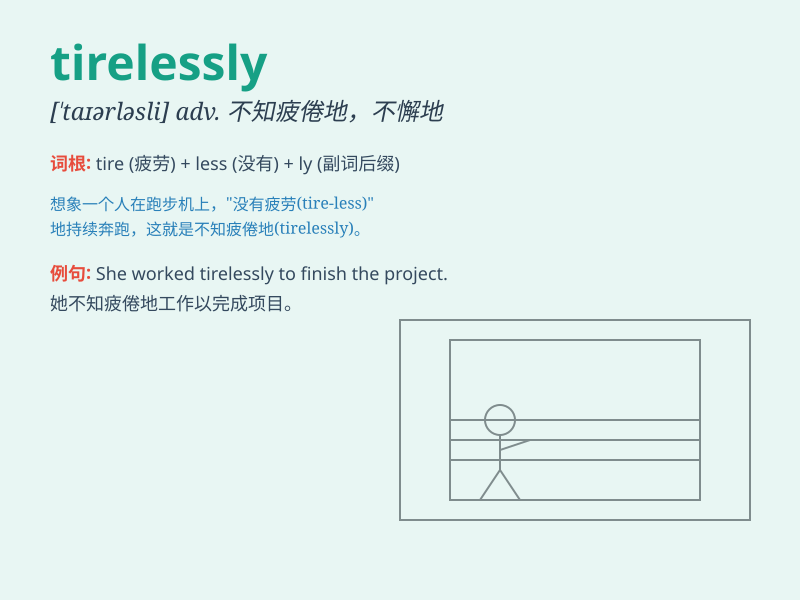

## tirelessly

**英音:** _[\'taɪələsli]_ **美音:** _[\'taɪələsli]_

**译义:** *adv.不知疲倦地,不屈不挠地*

### 短语

+ **work tirelessly:** _不知疲倦地工作_

+ **strive tirelessly:** _不懈地努力_

+ **search tirelessly:** _不知疲倦地搜寻_

+ **pursue tirelessly:** _不懈地追求_

+ **practice tirelessly:** _不知疲倦地练习_

### 例句

#### 例句1

> **She worked tirelessly to finish the project on time.**

**中文翻译:** 她不知疲倦地工作以按时完成项目。

**单词释义:** 不知疲倦地

#### 例句2

> **The doctor cared for the patients tirelessly.**

**中文翻译:** 这位医生不知疲倦地照顾病人。

**单词释义:** 不知疲倦地

#### 例句3

> **He searched tirelessly for the lost keys.**

**中文翻译:** 他不知疲倦地寻找丢失的钥匙。

**单词释义:** 不知疲倦地

### 背诵小故事

> A little ant was carrying food tirelessly. It never stopped or felt
tired, just kept going. It showed us what it means to work tirelessly,
always giving its best effort.

**一只小蚂蚁不知疲倦地搬运着食物。它从未停歇或感到疲惫，一直在前进。这向我们展示了
tirelessly 这个词的意思，即一直竭尽全力地工作。**

### 图义

