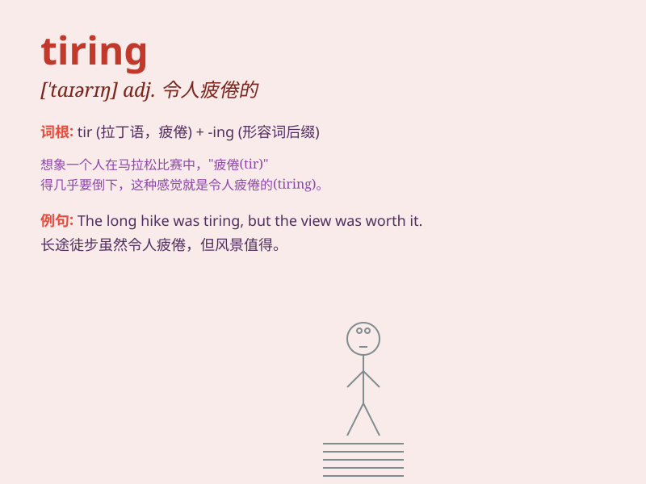

## tiring

**英音:** _[\'taɪərɪŋ]_ **美音:** _[\'taɪərɪŋ]_

**译义:** *adj.引起疲劳的,累人的*

### 短语

+ **tiring work:** _累人的工作_

+ **a tiring journey:** _一次令人疲倦的旅行_

+ **tiring exercise:** _累人的锻炼_

+ **tiring day:** _令人疲惫的一天_

+ **find sth tiring:** _发现某事令人疲倦_

### 例句

#### 例句1

> **Running a marathon is a tiring activity.**

**中文翻译:** 跑马拉松是一项累人的活动。

**单词释义:** 令人疲倦的

#### 例句2

> **The long meeting was very tiring.**

**中文翻译:** 这个漫长的会议非常令人疲惫。

**单词释义:** 使人疲劳的

#### 例句3

> **Carrying heavy boxes all day is such a tiring job.**

**中文翻译:** 整天搬运沉重的箱子是如此累人的工作。

**单词释义:** 令人劳累的

### 背诵小故事

> One day, I went hiking. The long and steep mountain path was really
tiring. I felt exhausted after hours of walking. But when I reached the
top and saw the beautiful view, it was all worth it.

**有一天，我去远足。漫长又陡峭的山路真的很累人。走了几个小时后我感到筋疲力尽。但当我到达山顶看到美丽的景色时，一切都值了。**

### 图义

