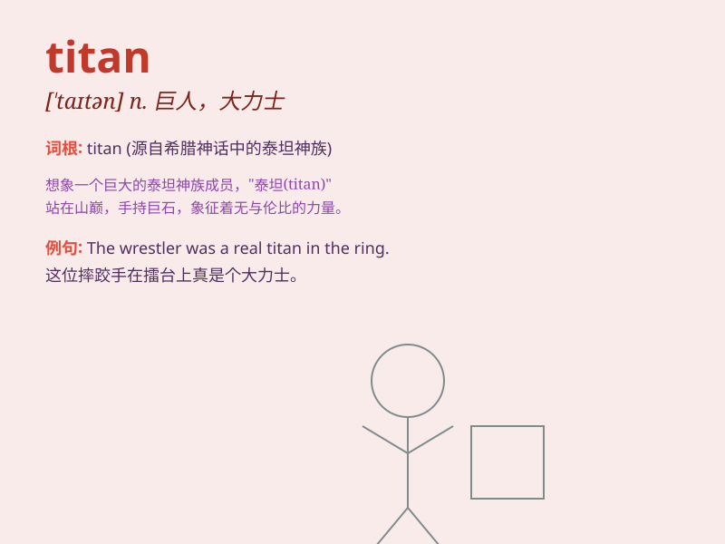

## titan

**英音:** _[taɪtn]_ **美音:** _[taɪtn]_

**译义:** *n.[希神]提坦,太阳神,巨人*

### 短语

+ **Titan of industry:** _工业巨头_

+ **Titan of literature:** _文学巨匠_

+ **Titan of thought:** _思想巨擘_

+ **Titan of the sea:** _海上巨无霸_

+ **Titan of the stage:** _舞台巨星_

### 例句

#### 例句1

> **The titan of industry dominated the market for decades.**

**中文翻译:** 这位工业巨头主导市场数十年。

**单词释义:** 巨头；巨人

#### 例句2

> **The movie features a battle between two titans.**

**中文翻译:** 这部电影展现了两个巨人之间的战斗。

**单词释义:** 巨人；强大的人或事物

#### 例句3

> **He is considered a titan in the field of science.**

**中文翻译:** 他在科学领域被视为一位巨擘。

**单词释义:** 巨擘；杰出人物

### 背诵小故事

> In ancient times, there was a powerful being named Titan. He was so
strong that he could move mountains. People were in awe of his immense
strength. Remember, Titan means a person or thing of very great size,
strength, or importance.

**在古代，有一个强大的存在叫做泰坦。他非常强壮，能够移山。人们对他巨大的力量感到敬畏。记住，titan
指的是体型、力量或重要性极大的人或物。**

### 图义

