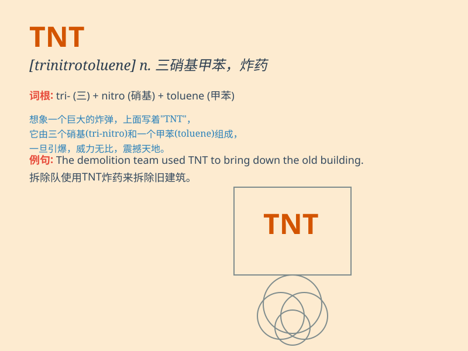

## TNT

**英音:** _[tiː en\'tiː]_ **美音:** _[tiː en\'tiː]_

**译义:** *n. 三硝基甲苯，一种黄色炸药，常用于军事和工业用途。*

### 短语

+ **TNT explosive:** _三硝基甲苯炸药_

+ **TNT equivalent:** _三硝基甲苯当量_

+ **TNT bomb:** _三硝基甲苯炸弹_

+ **handle TNT:** _处理三硝基甲苯_

+ **transport TNT:** _运输三硝基甲苯_

### 例句

#### 例句1

> **The bomb was made with TNT and caused a huge explosion.**

**中文翻译:** 这枚炸弹是用 TNT 制成的，并造成了巨大的爆炸。

**单词释义:** 三硝基甲苯，一种强力炸药

#### 例句2

> **The workers were handling TNT with extreme caution.**

**中文翻译:** 工人们极其小心地处理着 TNT。

**单词释义:** 三硝基甲苯，一种强力炸药

#### 例句3

> **They stored the TNT in a secure facility.**

**中文翻译:** 他们把 TNT 储存在一个安全的设施里。

**单词释义:** 三硝基甲苯，一种强力炸药

### 背诵小故事

> 想象一下，有个疯狂的科学家在实验室里捣鼓着一种威力巨大的物质，它叫
TNT
。每次实验都伴随着巨大的爆炸声和耀眼的光芒，所有人都对这种危险又强大的东西印象深刻。

**想象有个疯狂科学家在实验室研究叫 TNT
的强大危险物质，每次实验都有巨响和强光，让人印象深刻。**

### 图义

