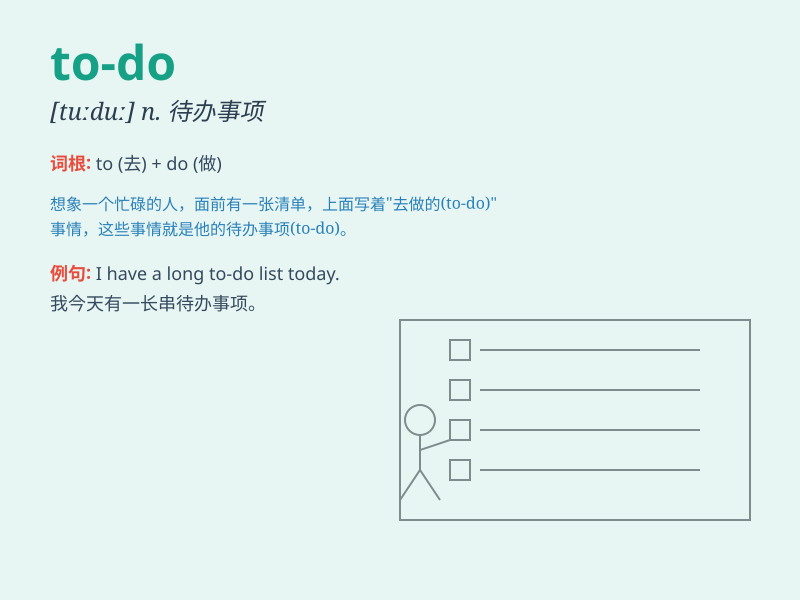

## to-do

**英音:** _[tə ˈduː]_ **美音:** _[tuː ˈduː]_

**译义:** *n. 待办事项；要做的事；任务清单*

### 短语

+ **a long to-do list:** _一长串待办事项清单_

+ **make a to-do list:** _制作一份待办事项清单_

+ **cross off the to-do:** _划掉待办事项_

+ **prioritize the to-do:** _确定待办事项的优先级_

+ **update the to-do:** _更新待办事项_

### 例句

#### 例句1

> **I have a long to-do list for the weekend.**

**中文翻译:** 我周末有一长串的待办事项清单。

**单词释义:** 待办事项

#### 例句2

> **The to-do for today includes finishing the report and attending
the meeting.**

**中文翻译:** 今天的待办事项包括完成报告和参加会议。

**单词释义:** 待办事项

#### 例句3

> **She crossed off the completed to-do from her list.**

**中文翻译:** 她从清单上划掉了已完成的待办事项。

**单词释义:** 待办事项

### 背诵小故事

>
想象一下，小明有一张写满待办事项（to-do）的清单，比如做作业、打扫房间、买东西。他每完成一项，就从清单上划掉。这张清单就是他的
to-do list，提醒他还有哪些事情要做。

**想象小明有一张写满待办事项的清单，他每完成一项就划掉，这张清单提醒他还有哪些事要做**

### 图义

