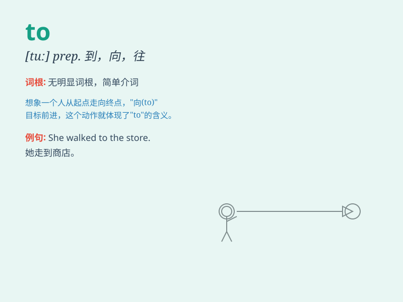

## to

**英音:** _[tə;tu;tuː]_ **美音:** _[tə;tu;tuː]_

**译义:** *
prep.向,往,给\...,于\...,直到\...为止,在\...之前,比,对,[表示程度、范围]
到,达 [域] Tonga ,汤加*

### 短语

+ **up to:** _多达；直到；胜任；取决于_

+ **due to:** _由于；应归于_

+ **close to:** _接近于；在附近_

+ **next to:** _紧邻；在......近旁_

+ **according to:** _根据；按照_

### 例句

#### 例句1

> **I\'m going to the store.**

**中文翻译:** 我要去商店。

**单词释义:** 到；向；往

#### 例句2

> **She gave the book to me.**

**中文翻译:** 她把那本书给了我。

**单词释义:** 给

#### 例句3

> **The road leads to the mountain.**

**中文翻译:** 这条路通向那座山。

**单词释义:** 通向

### 背诵小故事

> One day, a little bird wanted to fly to a beautiful garden. It spread
its wings and flew hard. \'To\' here shows the direction and goal of the
bird\'s flight. It means going towards a certain place.

**一天，一只小鸟想要飞到一个美丽的花园。它展开翅膀努力地飞。这里的'to'表示小鸟飞行的方向和目标。它的意思是朝着某个地方去。**

### 图义

